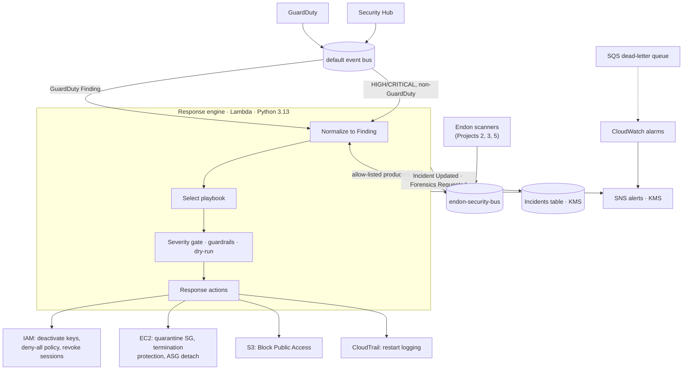

# Project 1 · AWS Automated Threat Detection & Response

> Part of the [Endon AI](../README.md) platform · **Status: built and tested** · deployable with AWS CDK

Turns high-confidence GuardDuty and Security Hub detections into contained,
fully documented incidents in seconds, with guardrails that make automated
response safe to leave switched on.

---

## The Security Problem

A company runs production workloads on AWS. An access key belonging to a CI user
leaks: it gets committed to a repository, printed in a build log, or copied off a
laptop. The attacker uses it within minutes:

- enumerates S3 buckets and EC2 instances
- creates a second access key, so revoking the first does not lock them out
- opens SSH to the internet
- stops CloudTrail, so the rest of the attack goes unrecorded
- removes Block Public Access from a customer-data bucket
- starts a cryptominer on a web server

GuardDuty detects most of this. **But detection is not response.** Findings land in
a console that someone checks by hand. Every minute between the finding and the fix
is a minute the attacker keeps working, with logging switched off.

**Goal:** contain high-confidence threats automatically, within seconds of the
finding, without destroying evidence and without locking out the wrong people.

## Threat Model

Full model, including threats against the responder itself:
[architecture/threat-model.md](architecture/threat-model.md).

| Attacker technique (MITRE ATT&CK) | GuardDuty finding | Playbook | Automated response |
|---|---|---|---|
| Stolen cloud credentials used from a known-bad IP (T1078.004) | `UnauthorizedAccess:IAMUser/MaliciousIPCaller.Custom` | `compromised-credentials` | Deactivate every key, attach deny-all quarantine policy |
| Instance-role credentials used outside AWS (T1552.005) | `UnauthorizedAccess:IAMUser/InstanceCredentialExfiltration.OutsideAWS` | `instance-credential-exfiltration` | Revoke role sessions, tag instance, request forensics |
| Disable cloud logs (T1562.008) | `Stealth:IAMUser/CloudTrailLoggingDisabled` | `logging-tampering` | Restart logging; contain the principal at MEDIUM+ |
| Expose data in cloud storage (T1530) | `Policy:S3/BucketBlockPublicAccessDisabled` | `s3-public-exposure` | Re-enable all four Block Public Access settings |
| Resource hijacking / cryptomining (T1496) | `CryptoCurrency:EC2/BitcoinTool.B!DNS` | `compromised-ec2` | Isolate the instance, preserve evidence, request forensics |
| Cloud infrastructure discovery (T1580) | `Recon:IAMUser/MaliciousIPCaller.Custom` | `triage` | Record and alert. Reconnaissance alone is not auto-contained |

## Architecture



| Module | Responsibility |
|---|---|
| [`normalizers.py`](src/endon_detection/normalizers.py) | GuardDuty, Security Hub and Endon events → `Finding`; decides which sources are trusted |
| [`playbooks.py`](src/endon_detection/playbooks.py) | Ordered rules mapping finding type, source and resource role to a playbook |
| [`guardrails.py`](src/endon_detection/guardrails.py) | Refuses to touch protected resources, AWS service roles, or the responder's own role |
| [`engine.py`](src/endon_detection/engine.py) | Deduplication, gating, action execution, outcome, timeline, publishing |
| [`actions/`](src/endon_detection/actions/) | IAM, EC2, S3, CloudTrail and notification actions |
| [`rules.py`](src/endon_detection/rules.py) | EventBridge patterns, deployed by CDK and exercised by the tests |
| [`infrastructure/detection_stack.py`](infrastructure/detection_stack.py) | Lambda, rules, DLQ, alarms and the least-privilege response role |

Component design and the IAM permission model: [architecture/architecture.md](architecture/architecture.md).

## Attack Simulation

[attack-simulation/](attack-simulation/) runs the scenario above three ways:

1. **Offline replay** on emulated AWS: the full attack, detection, response and verification, with no account needed.
2. **GuardDuty sample findings** against a deployed stack. Always handled in dry-run.
3. **Live credential compromise** in a lab account, using a GuardDuty custom threat list
   so real API calls from a real IP raise real findings.

## Detection

- **GuardDuty** findings arrive on the default event bus through a dedicated rule.
- **Security Hub** findings are consumed only at HIGH/CRITICAL, only from AWS-integrated
  products, and never for GuardDuty (Security Hub re-publishes GuardDuty findings, so
  consuming both would open duplicate incidents).
- **Endon findings** from the posture scanner, IAM analyzer and data protection monitor
  arrive on the Endon bus, restricted to an allowlist of producer sources.
- Every finding is normalized into one `Finding` model. GuardDuty's `resourceRole`
  (ACTOR vs TARGET) is preserved, so an instance *attacking* others is treated
  differently from one *being attacked*.
- GuardDuty re-sends a finding each time activity recurs. Incidents have deterministic
  IDs and are created with a DynamoDB conditional write, so a re-delivery never
  repeats a response. The engine only re-runs a response if the earlier one failed,
  ran in dry-run, or the severity escalated.

## Automated Response

| Action | Kind | What it does |
|---|---|---|
| `disable_access_keys` | CONTAIN | Deactivates **every** active key on the user. Attackers create extra keys for persistence |
| `quarantine_iam_user` | CONTAIN | Attaches an inline `Deny *` policy, which overrides every Allow including AdministratorAccess |
| `revoke_role_sessions` | CONTAIN | Denies sessions issued before now (`aws:TokenIssueTime`). Temporary credentials cannot be deleted |
| `isolate_instance` | CONTAIN | Detaches from Auto Scaling, enables termination protection, moves every ENI to a no-rules security group |
| `restore_cloudtrail_logging` | REMEDIATE | Restarts any stopped trail in the region |
| `block_s3_public_access` | REMEDIATE | Enables all four Block Public Access settings and merges incident tags into existing ones |
| `request_forensics` | EVIDENCE | Publishes `Endon Forensics Requested` for the forensics component |
| `tag_for_review` | EVIDENCE | Tags the resource with the incident ID |
| `notify` | REPORT | SNS alert with the final status and every action's result. Always runs last |

Every change passes through these layers, in order:

1. **Severity gate:** CONTAIN actions run only at or above the playbook's threshold.
2. **Guardrails:** resources tagged `endon:protected=true`, AWS service-linked and reserved
   roles, and the responder's own role are never changed. If a guardrail check itself
   fails, the engine does not act.
3. **Dry-run:** in `dry_run` mode, and for every GuardDuty sample finding, each action
   records `Would ...` instead of changing anything.
4. **Isolation between actions:** a failing action is recorded and the rest of the playbook
   still runs. A partially contained incident is retried when the finding is re-delivered.

## Evidence

Offline replay of the full attack ([full output](evidence/offline-replay.txt)):

```text
PHASE 3 - VERIFY THE ACCOUNT STATE THROUGH THE AWS APIs
  Access keys for ci-deploy-bot.................. COD6EB=Inactive, HQ3G7H=Inactive
  Quarantine deny-all policy..................... attached
  CloudTrail acme-audit-trail.................... logging
  Block Public Access on acme-customer-exports... all four settings on
  web-01 security groups......................... endon-quarantine
  web-01 termination protection.................. on
  web-01 state................................... running (memory preserved for forensics)
  Forensics requests on the Endon bus............ 1
  Alerts delivered to the SOC queue.............. 5

  5 findings -> 5 incidents (4 CONTAINED, 1 MONITORING)
```

Live-account evidence (CloudTrail records of the responder's API calls, the incident
item in DynamoDB, the alert email, the isolated instance) is collected with the
checklist in [evidence/README.md](evidence/README.md).

## Security Decisions

1. **Deactivate, never delete.** Keys are set to `Inactive`, and access is removed with deny
   policies rather than by detaching existing policies. Evidence survives and every
   change can be reversed.
2. **Isolate, never terminate.** A compromised instance's memory and disk are evidence. It
   stays running, protected from termination, and detached from its Auto Scaling group so
   a health check cannot replace and terminate it.
3. **Cut live sessions, not just new ones.** Security group changes don't interrupt tracked
   connections, so an attacker's open shell would survive a direct switch. The ENI first
   moves to an allow-all group, which makes its flows untracked, and then to the empty
   quarantine group, which cuts them immediately.
4. **The quarantine group is re-verified on every use.** One rule added to it would silently
   reopen every isolated instance in the VPC.
5. **Probed is not compromised.** An instance that is the *target* of port probes or brute
   force is flagged, not taken offline. Isolating it would hand the attacker a
   denial-of-service.
6. **Reconnaissance, root activity and IAM misconfigurations alert humans.** Auto-containing
   on low-confidence signals, locking the root user, or stripping IAM permissions would
   cause outages that do more damage than the finding.
7. **Low-severity log tampering restores logging but does not lock anyone out.** GuardDuty
   rates `CloudTrailLoggingDisabled` LOW. Restarting the trail is always safe; quarantining
   a possibly legitimate administrator is not.
8. **Endon's own findings can fix configuration but never contain principals or hosts.**
   Anyone with `events:PutEvents` on the Endon bus could forge one. AWS-sourced events
   cannot be forged, so only they unlock containment playbooks.
9. **Dry-run by default, enforce by explicit choice.** Any value other than exactly `enforce`,
   including a typo, runs in dry-run.
10. **The responder cannot modify itself.** It needs `iam:PutRolePolicy` to revoke sessions, so
    an explicit deny on its own role stops compromised code from granting itself more.

## Limitations

- **Regional.** GuardDuty findings are regional, so the engine is deployed per region. IAM
  containment is global.
- **Detection latency is GuardDuty's.** "Seconds" measures finding-to-containment. GuardDuty
  itself typically delivers a new finding within minutes of the activity.
- **ICMP and some flows are always tracked,** so the untracked-transition technique does not
  cut them. A subnet NACL would, but it affects every host in the subnet.
- **Revoking role sessions affects every holder** of that role, including healthy instances
  sharing it. They recover automatically by fetching new credentials.
- **Persistence beyond access keys** (new users, roles, login profiles, backdoored Lambda
  functions) is flagged for investigation, not removed automatically.
- **Organization trails** can only be restarted from the management account.
- **Attacker changes that are not findings,** such as the SSH rule opened in the replay, are
  left to the posture scanner (Project 3).
- **The responder role is powerful.** `iam:PutUserPolicy` cannot be restricted by policy
  content. The self-modification deny and pipeline-only deployments reduce the risk, but
  do not remove it.
- **Offline timings** measure engine processing against emulated APIs, not real-world
  response time.

## Lessons Learned

- **GuardDuty's `IAMUser` category is about any principal**, including roles, federated users
  and root. Playbooks have to branch on the resource, not the finding's name.
- **Changing a security group does not end an attacker's session.** Connection tracking makes
  the obvious isolation step incomplete.
- **Most of an automated responder is deciding when not to act.** Containment itself is a few
  API calls. Severity gates, source trust, guardrails and idempotency are what make those
  calls safe.
- **Security Hub and GuardDuty overlap.** Without filtering, one threat becomes two incidents.
- **Emulators are not AWS.** moto reports an attached ENI's security groups differently from
  EC2, so tests assert against the API that the action actually changes.

## Run It

Tests, from the repository root, with AWS emulated by moto:

```bash
pytest endon-core/tests 01-threat-detection-response/tests tests
```

Offline attack replay:

```bash
python 01-threat-detection-response/attack-simulation/offline_replay.py
```

Deploy (starts in dry-run):

```bash
cdk deploy EndonPlatform EndonDetectionResponse
```

Turn on automated containment once dry-run incidents look right:

```bash
cdk deploy EndonDetectionResponse -c endon:responseMode=enforce
```

## Project Layout

```text
01-threat-detection-response/
├── README.md
├── CASE_STUDY.md
├── SECURITY.md
├── architecture/
│   ├── architecture.md
│   └── threat-model.md
├── src/endon_detection/
│   ├── handler.py          Lambda entry point
│   ├── engine.py           response orchestration
│   ├── normalizers.py      GuardDuty / Security Hub / Endon → Finding
│   ├── playbooks.py        finding → playbook rules
│   ├── guardrails.py       safety checks
│   ├── rules.py            EventBridge patterns
│   ├── samples.py          GuardDuty event builders
│   └── actions/            iam, ec2, s3, cloudtrail, notify
├── infrastructure/
│   └── detection_stack.py
├── attack-simulation/
├── evidence/
└── tests/
```
