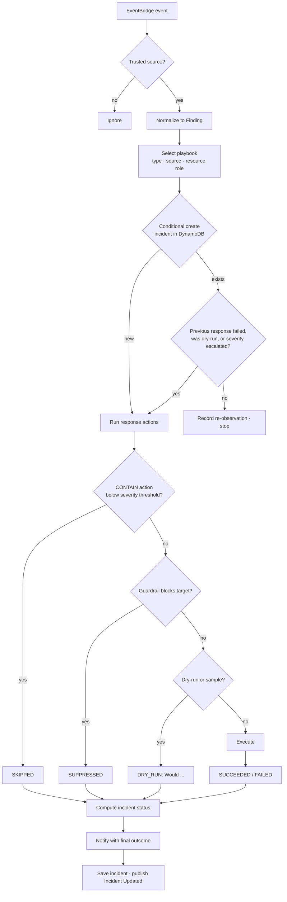

# Response Engine Design

## Processing a finding

## Incident status

| Status | Meaning |
|---|---|
| `CONTAINED` | Every containment or remediation action that ran succeeded |
| `PARTIALLY_CONTAINED` | Some succeeded, some failed; retried on re-delivery |
| `FAILED` | Every attempted containment failed; retried on re-delivery |
| `SUPPRESSED` | A guardrail blocked containment; a human must decide |
| `MONITORING` | No containment warranted; recorded and, if significant, alerted |
| `DRY_RUN` | Actions recorded as intentions only |

`time_to_contain_seconds` is measured from GuardDuty's `eventFirstSeen` to the moment
containment completed.

## IAM permission model

The response role is generated by `detection_stack.py`. The infrastructure tests
synthesize it and fail if any write action is granted on `*`.

| Statement | Actions | Resources |
|---|---|---|
| `ContainIamUsers` | `ListAccessKeys`, `UpdateAccessKey`, `PutUserPolicy`, `TagUser`, `ListUserTags` | `arn:aws:iam::<account>:user/*` |
| `ContainIamRoles` | `GetRole`, `ListRoleTags`, `PutRolePolicy`, `TagRole` | `arn:aws:iam::<account>:role/*` |
| `InspectResources` | `ec2:DescribeInstances`, `ec2:DescribeSecurityGroups`, `autoscaling:DescribeAutoScalingInstances`, `cloudtrail:DescribeTrails` | `*` (no resource-level support) |
| `IsolateEc2Instances` | security group create/authorize/revoke, `ModifyNetworkInterfaceAttribute`, `ModifyInstanceAttribute`, `CreateTags` | `arn:aws:ec2:<region>:<account>:*` |
| `DetachFromAutoScaling` | `autoscaling:DetachInstances` | Auto Scaling group ARNs in the account and region |
| `BlockS3PublicAccess` | `PutBucketPublicAccessBlock`, `GetBucketTagging`, `PutBucketTagging` | `arn:aws:s3:::*` |
| `RestoreCloudTrailLogging` | `GetTrailStatus`, `StartLogging` | Trail ARNs in the account and region |
| **`DenySelfModification`** | every role-policy, trust-policy and boundary change | the responder's own role |
| **`DenyAwsManagedRoles`** | `PutRolePolicy`, `TagRole` | `role/aws-service-role/*`, `role/aws-reserved/*` |

Platform access (incidents table, event bus, alerts topic, KMS key) comes from CDK
grants scoped to those specific resources.

## Reliability

| Failure | Handling |
|---|---|
| Lambda error or throttle | EventBridge retries for up to 6 hours, then the dead-letter queue |
| Undeliverable event | SQS dead-letter queue (14 days) plus a CloudWatch alarm to the alerts topic |
| Unhandled function error | CloudWatch alarm to the alerts topic |
| One action fails | Recorded as `FAILED`; the remaining actions still run |
| Duplicate delivery | Deterministic incident ID plus conditional write |
| Incident update fails to publish | Logged; the stored incident remains the source of truth |
