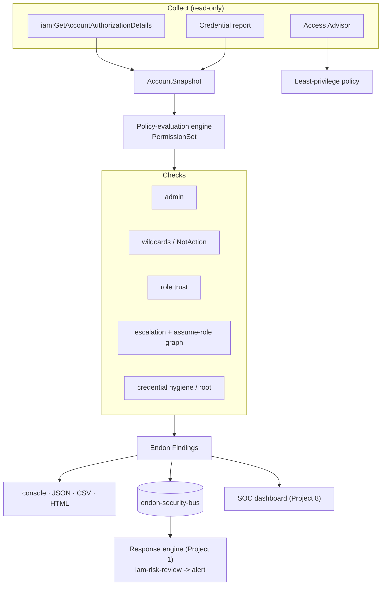

# Project 2 · IAM Least-Privilege & Privilege-Escalation Analyzer

> Part of the [Endon AI](../README.md) platform · **Status: built and tested** · CLI + scheduled Lambda

Reads an account's entire IAM configuration and answers the question IAM itself makes
hard: *who can actually reach administrator, and how?* It finds over-privilege,
dangerous trust policies, weak credentials, and — the part that matters most —
**privilege-escalation paths**, including ones that hop through assumable roles.

---

## The Security Problem

IAM is the largest single domain on the AWS Security Specialty exam, and the hardest to
get right in practice, because permissions drift. Accounts accumulate
`AdministratorAccess` attachments, `"Action": "*"` policies, users nobody owns, access
keys that are years old, and roles that trust the whole internet.

The dangerous risks are the ones you cannot see by reading a single policy. A role with

```json
{ "Effect": "Allow", "Action": "iam:PassRole", "Resource": "*" }
```

plus permission to create a Lambda function is administrator-equivalent — it can pass a
privileged role to code it controls. A user who can only `sts:AssumeRole` looks harmless
until you notice the role it assumes can attach policies to itself. **No policy read in
isolation reveals these. You have to evaluate effective permissions across the account
and follow the graph.**

**Goal:** given read-only access to an account, produce an assessment a human can act
on — over-privilege ranked by severity, every escalation path with the exact permissions
that enable it, and a least-privilege starting policy for the worst offenders.

## Threat Model

Full model: [architecture/threat-model.md](architecture/threat-model.md). The escalation
techniques follow Rhino Security Labs' well-known catalogue of AWS IAM privilege
escalation methods.

| Weakness | ATT&CK | What the analyzer reports |
|---|---|---|
| Administrator-equivalent user/role/group | T1078 Valid Accounts | `IAM:*/AdministratorAccess` |
| Self-service permission grant (AttachUserPolicy, PutUserPolicy, CreatePolicyVersion, …) | T1548 Abuse Elevation Control | `IAM:*/PrivilegeEscalation` (direct) |
| PassRole to a compute service (Lambda, EC2, CloudFormation, Glue, SageMaker) | T1548 / T1098 | `IAM:*/PrivilegeEscalation` (compute) |
| Escalation reachable through an assumable role | T1550.001 | `IAM:*/PrivilegeEscalation` (via role, with the path) |
| Role trusts an external account with no ExternalId | T1199 Trusted Relationship | `IAM:Role/TrustsExternalAccount` |
| Role trusts any principal (`"*"`) | T1199 | `IAM:Role/TrustsAnyPrincipal` |
| Wildcard / NotAction over-permission | T1078 | `IAM:Policy/WildcardAction`, `IAM:Policy/NotActionWithAllow` |
| Root access keys, no-MFA console users, stale/unused keys | T1078.004 | `IAM:Root/*`, `IAM:User/MissingMfa`, `IAM:AccessKey/*` |

## Architecture



The core is a real, if deliberately scoped, **policy-evaluation engine**
([policy.py](src/endon_iam_analyzer/policy.py)): explicit deny wins, and every grant is
reduced to three facts — *allowed, on any resource, conditional* — which is exactly what
separates a real escalation path from a scoped one. The **escalation graph**
([escalation.py](src/endon_iam_analyzer/escalation.py)) then adds transitive reachability
through `sts:AssumeRole`, building an edge only when the caller is allowed to assume the
role *and* the role's trust policy admits the caller.

| Module | Responsibility |
|---|---|
| [`policy.py`](src/endon_iam_analyzer/policy.py) | Statement parsing, action/resource wildcard matching, deny-wins evaluation, admin detection |
| [`models.py`](src/endon_iam_analyzer/models.py) | `AccountSnapshot`, principals, effective permissions across group membership |
| [`escalation.py`](src/endon_iam_analyzer/escalation.py) | Escalation techniques and the assume-role reachability graph |
| [`checks/`](src/endon_iam_analyzer/checks) | admin, wildcards, trust, credentials, escalation → findings |
| [`snapshot.py`](src/endon_iam_analyzer/snapshot.py) | Build the snapshot from boto3 (authorization details + credential report) |
| [`leastprivilege.py`](src/endon_iam_analyzer/leastprivilege.py) | Generate a least-privilege policy from Access Advisor usage |
| [`reporting/`](src/endon_iam_analyzer/reporting) | console, JSON, CSV, self-contained HTML |
| [`cli.py`](src/endon_iam_analyzer/cli.py) | `endon-iam-analyzer scan` with `--fail-on` for CI gating |
| [`infrastructure/`](infrastructure/iam_analyzer_stack.py) | Scheduled, **read-only** Lambda that scans, publishes findings, stores HTML reports |

## Attack Simulation

[attack-simulation/](attack-simulation/) contains a deliberately vulnerable account with
every issue planted once — plus correctly configured principals to prove it does not
raise false positives. It runs offline (no AWS account) and is the same fixture the tests
assert against, so the demo and the test suite can never drift apart.

```bash
python 02-iam-security-analyzer/attack-simulation/offline_scan.py
```

## Detection

- **One snapshot, no per-principal calls.** `iam:GetAccountAuthorizationDetails` returns
  every user, group, role and attached policy document in a few paginated calls; the
  credential report adds password, MFA and key state.
- **Effective permissions, not raw policies.** For a user, the engine unions inline
  policies, attached managed policies, and every group's policies before evaluating.
- **Admin is detected from the document,** not from a policy name, so a home-grown
  `Action:"*"` policy is caught the same as `AdministratorAccess`.
- **Escalation confidence is graded.** A grant on `Resource:"*"` with no condition is
  high confidence; a scoped or conditional grant is still reported, one severity lower,
  marked `conditional-or-scoped`.
- **The graph is conservative.** An assume-role edge exists only when *both* sides agree:
  the caller can assume, and the trust policy admits it. A trust that names a different
  user produces no edge, so the analyzer does not invent paths.

## Findings & Response

Findings are `IAM:*` types with `domain = Identity and Access Management`. Published to
`endon-security-bus`, the Project 1 response engine routes them to its `iam-risk-review`
playbook, which **alerts and records but never changes IAM** — automatically stripping
permissions would break production. That boundary is enforced in code and covered by
[`test_integration.py`](tests/test_integration.py).

The CLI's `--fail-on CRITICAL` turns the analyzer into a CI gate (Project 7 uses it),
failing a build when a change introduces an admin or escalation path.

## Evidence

Offline scan of the vulnerable account ([full output](evidence/offline-scan.txt),
[HTML report](evidence/iam-assessment.html)):

```text
ENDON AI - IAM SECURITY ASSESSMENT  (111122223333 / us-east-1)
Users scanned: 8   Roles scanned: 5   Policies scanned: 8
Findings: CRITICAL 8   HIGH 8   MEDIUM 3
IAM security score: 0/100

PRIVILEGE-ESCALATION PATHS
  user bob-escalator: direct via AttachUserPolicy
  user carol-passrole: direct via PassRoleToLambda
  user mallory: user:mallory -> role:escalation-target-role then AttachUserPolicy
  role escalation-target-role: direct via AttachUserPolicy
```

`mallory` holds only `sts:AssumeRole` — the analyzer found her escalation path by
following the graph to a role that can attach policies to itself.

## Security Decisions

1. **Read-only, always.** The Lambda role has no IAM write permission of any kind. An
   analyzer that could change IAM would be the escalation risk it exists to find. The
   [infrastructure test](../tests/test_iam_analyzer_infrastructure.py) fails the build if
   any `iam:` action that is not a `Get`/`List`/`Generate`/`Simulate` is ever granted.
2. **Report, never auto-remediate.** IAM findings alert a human. There is no safe generic
   "fix" for an over-permission — removing it may break a workload — so the decision stays
   with a person.
3. **Grade confidence instead of hiding uncertainty.** Conditions are surfaced, not
   evaluated. A conditional grant is shown as conditional and down-weighted, rather than
   silently dropped (false negative) or treated as fully open (false positive).
4. **Break-glass is respected.** Admin and escalation on a principal tagged
   `endon:protected=true` are downgraded, not hidden — the same tag Project 1 honours.
5. **Trust findings require real external exposure.** An external-account trust *with* an
   `sts:ExternalId` condition is correctly configured and produces no finding.

## Limitations

- **Effective permissions, not resource policies.** The analyzer evaluates identity-based
  policies. It does not yet reason about resource policies (S3 bucket policies, KMS key
  policies) or permissions boundaries as *limiters*, though it flags a missing boundary as
  a remediation.
- **Conditions are flagged, not solved.** It does not resolve condition keys, `aws:`
  variables, or session tags, by design. A condition-gated grant is reported as conditional.
- **Access Advisor is best-effort.** Least-privilege generation needs the service-last-
  accessed report, which is asynchronous and not fully emulated offline; the generator is
  unit-tested against supplied usage data.
- **Assume-role graph within one account.** Cross-account assume chains are out of scope
  until the multi-account landing zone (Project 6).
- **A snapshot is a point in time.** Scheduled daily; between runs, drift is invisible
  (GuardDuty and the posture scanner cover in-the-moment changes).

## Lessons Learned

- **The interesting risk is emergent.** Most single policies look reasonable. Escalation
  lives in the *combination* of a grant and a reachable target, which is why the engine
  had to compute effective permissions and a graph, not scan policies one at a time.
- **`iam:PassRole` is the quiet one.** On `Resource:"*"` with any compute-create
  permission, it is administrator-equivalent, and it rarely looks alarming in review.
- **Confidence grading beats a boolean.** Treating every scoped grant as either "fine" or
  "critical" produces either misses or noise; a graded, explained finding is what a human
  can actually triage.
- **Emulators lie in small ways.** moto omits `PolicyName` from authorization details and
  ships no attachable AWS-managed policies, so the snapshot builder derives names from
  ARNs and the tests use customer-managed equivalents.

## Run It

```bash
# offline, no AWS account
python 02-iam-security-analyzer/attack-simulation/offline_scan.py

# tests
pytest 02-iam-security-analyzer/tests

# scan a real account (read-only)
endon-iam-analyzer scan --region us-east-1 --formats console,html --output-dir reports/
endon-iam-analyzer scan --region us-east-1 --fail-on CRITICAL   # CI gate

# deploy the scheduled analyzer
cdk deploy EndonIamAnalyzer
```

## Project Layout

```text
02-iam-security-analyzer/
├── README.md · CASE_STUDY.md · SECURITY.md
├── architecture/{architecture.md, threat-model.md}
├── src/endon_iam_analyzer/
│   ├── policy.py          evaluation engine
│   ├── models.py          account snapshot
│   ├── escalation.py      techniques + assume-role graph
│   ├── snapshot.py        boto3 -> snapshot
│   ├── leastprivilege.py  least-privilege policy generation
│   ├── analyzer.py        run checks, score
│   ├── checks/            admin, wildcards, trust, credentials, escalation
│   ├── reporting/         console, json, csv, html
│   ├── publish.py         findings -> endon bus
│   ├── cli.py / handler.py
├── infrastructure/iam_analyzer_stack.py
├── attack-simulation/offline_scan.py
├── evidence/
└── tests/
```
