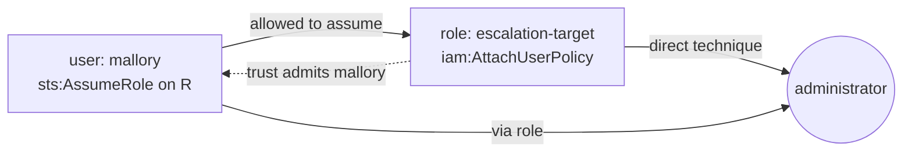

# IAM Analyzer Design

## The evaluation engine

IAM's real evaluation rule is simple to state and easy to get subtly wrong: an explicit
`Deny` always wins; otherwise access requires a matching `Allow`. The engine
([policy.py](../src/endon_iam_analyzer/policy.py)) implements this for the three questions
a security analyzer actually asks.

```python
access = permission_set.evaluate("iam:PassRole")  # requires Resource:"*"
access = permission_set.evaluate("s3:GetObject", bucket)  # a specific resource
access = permission_set.evaluate_action("iam:PutUserPolicy")  # any resource, graded
```

Every result is an `Access(allowed, on_any_resource, conditional, resources)`:

| Field | Meaning | Why it matters |
|---|---|---|
| `allowed` | a matching Allow exists and no unconditional Deny blocks it | the base question |
| `on_any_resource` | the grant is on `Resource:"*"` (or `NotResource`) | `PassRole` on `*` is escalation; on one role, far less |
| `conditional` | every matching Allow carries a `Condition` | a gated grant is a weaker signal |

**Deny handling.** An unconditional Deny that matches rules the action out. A *conditional*
Deny might not apply, so it does not — the analyzer asks "could this happen", and errs
toward surfacing. Conditions are never evaluated; they are reported.

**Action and resource matching.** Actions match case-insensitively with `*`/`?` wildcards
(`s3:Get*` matches `s3:GetObject`); resources match case-sensitively, as IAM does. `Admin`
is detected structurally: an Allow with `*`/`*:*` on any resource with no condition.
`NotAction` with `Allow` is handled correctly (grants everything except the listed
actions) and flagged as its own smell.

## The escalation graph



An edge `principal -> role` is added only when **both** are true:

1. the principal's permissions allow `sts:AssumeRole` on that role's ARN, and
2. the role's trust policy admits the principal (its ARN, its account root, or `"*"`).

Reachability is then closed transitively with a breadth-first walk that records the
shortest path to each escalating role. A principal is reported with an escalation finding
if it can escalate directly *or* reach a role that can. An account admin trivially
satisfies every technique, so admin is reported as admin, not as nineteen escalation
techniques.

## Checks and scoring

Each check is a function that reads the snapshot and yields findings; the analyzer runs
all registered checks and de-duplicates by finding id.

| Check | Findings |
|---|---|
| admin | `IAM:User/Role/Group AdministratorAccess` |
| wildcards | `IAM:Policy/WildcardAction`, `IAM:Policy/NotActionWithAllow` |
| trust | `IAM:Role/TrustsExternalAccount`, `IAM:Role/TrustsAnyPrincipal` |
| escalation | `IAM:User/Role/PrivilegeEscalation` |
| credentials | `IAM:User/MissingMfa`, `IAM:AccessKey/Stale`, `IAM:AccessKey/Unused`, `IAM:User/MultipleActiveKeys` |
| root | `IAM:Root/AccessKeyActive`, `IAM:Root/MfaDisabled` |

The IAM security score is `100 - Σ weights`, floored at 0, with CRITICAL 25, HIGH 10,
MEDIUM 3, LOW 1. It is a blunt headline number, deliberately: the findings are the detail.

## Permission model of the analyzer itself

The Lambda role is read-only. Every granted `iam:` action is a `Get`, `List`, `Generate`
or `Simulate`; there is no `Put`, `Attach`, `Create`, `Update` or `Delete`. It can publish
to the Endon bus and write reports to the evidence bucket, nothing more. This is asserted
by [`tests/test_iam_analyzer_infrastructure.py`](../../tests/test_iam_analyzer_infrastructure.py).

## Report formats

| Format | Use |
|---|---|
| console | quick terminal read, grouped by severity |
| JSON | machine consumption, diffing between runs |
| CSV | spreadsheet triage |
| HTML | shareable, self-contained (no external resources), for evidence |
