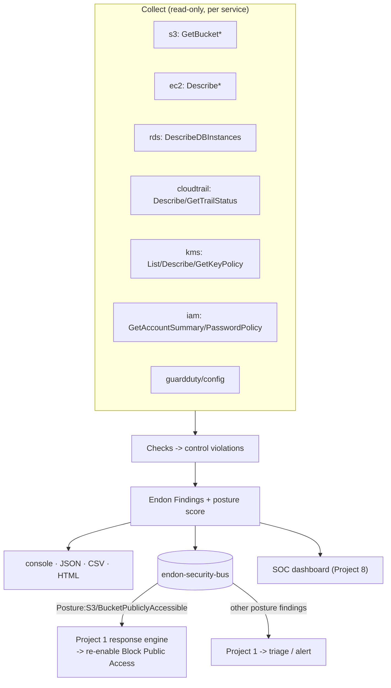

# Project 3 · AWS Cloud Security Posture Scanner

> Part of the [Endon AI](../README.md) platform · **Status: built and tested** · CLI + scheduled Lambda

A small, honest CSPM. It scans live AWS resource configuration across eight services
against a catalog of 26 controls, scores the account, and — the part that makes it
evidence rather than a claim — reports its **detection rate against a deliberately
vulnerable environment with a known number of planted misconfigurations**.

---

## The Security Problem

Most cloud incidents do not begin with a clever exploit. They begin with a
misconfiguration: a bucket made public, SSH open to `0.0.0.0/0`, logging switched off,
a database left unencrypted. Knowing that "AWS Config exists" is not the same as
understanding how these are actually found, or being able to prove you can find them.

Project 1 detects *behaviour* — GuardDuty tells you an attacker is acting. But an open
SSH rule or a public bucket is not an event; it is a *state*. Nothing emits a finding
when a security group is left open. Someone has to go and look.

**Goal:** given read-only access, continuously look — enumerate resource configuration
across services, judge each against a documented control, and produce a ranked,
remediable report. Then prove the scanner's coverage by measuring it against an
environment whose flaws are known in advance.

## What it checks

26 controls across eight services. Full catalog:
[src/endon_posture/controls.py](src/endon_posture/controls.py).

| Service | Controls (examples) |
|---|---|
| **S3** | public bucket (ACL/policy + Block Public Access), BPA not fully on, no default encryption, no TLS enforcement, no versioning, no logging |
| **EC2 / networking** | SSH/RDP/all-ports open to the internet, default SG not locked down, unencrypted EBS, EBS default encryption off, IMDSv2 not enforced |
| **RDS** | publicly accessible, storage not encrypted, backups disabled |
| **CloudTrail** | no multi-region trail, log file validation off, logs not KMS-encrypted, trail not logging |
| **KMS** | key rotation disabled, key policy allows `Principal:"*"` |
| **IAM** | weak/absent password policy, root access keys, root MFA disabled |
| **GuardDuty / Config** | detective services not enabled |

Each finding cites a stable control ID (`S3-001`, `EC2-004`, …), a severity, and
remediation. `Posture:S3/BucketPubliclyAccessible` is deliberately named to match the
Project 1 playbook that auto-remediates it.

## Architecture



| Module | Responsibility |
|---|---|
| [`controls.py`](src/endon_posture/controls.py) | The control catalog: id, severity, finding type, remediation |
| [`checks/`](src/endon_posture/checks) | One module per service; each yields findings for control violations |
| [`context.py`](src/endon_posture/context.py) | Shared clients, identity, and the finding builder |
| [`scanner.py`](src/endon_posture/scanner.py) | Runs every check, scores, tolerates per-service failures |
| [`reporting/`](src/endon_posture/reporting) | console, JSON, CSV, self-contained HTML |
| [`publish.py`](src/endon_posture/publish.py) | Findings → Endon bus |
| [`cli.py`](src/endon_posture/cli.py) | `endon-posture-scanner scan`, with `--fail-on` for CI |
| [`infrastructure/`](infrastructure/posture_scanner_stack.py) | Scheduled, **read-only** Lambda |

## Attack Simulation / Benchmark

The flagship evidence. [attack-simulation/](attack-simulation/) builds a deliberately
vulnerable environment through the real AWS APIs (emulated by moto), and — crucially —
records a **manifest** of exactly which control each planted misconfiguration should
trigger. The same environment and manifest are what the benchmark test asserts against,
so the demo and the test cannot drift.

```bash
python 03-security-posture-scanner/attack-simulation/offline_scan.py
```

```text
DETECTION BENCHMARK
  Planted misconfigurations : 26 controls across 8 services
  Detected                  : 26/26 (100%)
  Missed                    : none
  Additional (baseline)     : none
```

It also plants correctly configured resources (a hardened bucket, a scoped security
group, an encrypted volume, a private+encrypted database, an ExternalId-gated role) and
the benchmark asserts **none** of them are flagged — coverage is only meaningful next to
a low false-positive rate.

## Detection

- **Live configuration, not policy files.** The scanner calls `Describe`/`Get`/`List`
  across services and judges the actual state of each resource.
- **Effective public exposure for S3.** A bucket is only "publicly accessible" if a
  public ACL or wildcard-principal policy exists *and* Block Public Access is not fully
  enabled to neutralize it — matching how S3 actually resolves access. A wildcard policy
  gated by a condition (e.g. `aws:SourceVpce`) is not treated as public.
- **Port-range aware security groups.** An open rule is decoded by protocol and port
  range: `-1` (all protocols) raises the "all ports" control; a TCP range covering 22 or
  3389 raises SSH/RDP; a scoped CIDR raises nothing.
- **Region-correct.** Each bucket is scanned in its home region; IAM (global) is
  evaluated once; a multi-region trail is judged once. No duplicate findings.
- **Resilient.** A service the scanner cannot reach (no permission, not in use) is
  recorded in `errors` and skipped — one broken service never fails the whole scan.

## Findings & Response

Findings are `Posture:*` types, published to `endon-security-bus`. Most are
informational to the response engine and route to triage (recorded, alerted). The one
exception is `Posture:S3/BucketPubliclyAccessible`, which the Project 1 engine
auto-remediates by re-enabling Block Public Access — the scanner finds the exposure that
GuardDuty never emits an event for, and Project 1 closes it. This end-to-end path is
covered by [`test_integration.py`](tests/test_integration.py).

`endon-posture-scanner scan --fail-on HIGH` turns the scanner into a CI gate (Project 7
runs it after deployment).

## Evidence

Offline benchmark run: [evidence/offline-scan.txt](evidence/offline-scan.txt),
[HTML report](evidence/posture-assessment.html). 26/26 planted controls detected across
S3, EC2, RDS, CloudTrail, KMS, IAM, GuardDuty and Config, with no false positives on the
hardened resources.

## Security Decisions

1. **Read-only, enforced by the build.** The Lambda role holds only Describe/Get/List on
   the audited services. The [infrastructure test](../tests/test_posture_scanner_infrastructure.py)
   fails if any mutating action is ever granted on a scanned service.
2. **Detect, remediate one thing.** Only public-bucket exposure is auto-remediated (and
   only by Project 1, guardrailed). Everything else is reported — "fixing" a
   misconfiguration blindly (encrypting a volume, closing a port) can break a workload.
3. **A benchmark, not a boast.** Detection rate is measured against a known manifest, so
   a regression that stops finding something fails a test. False positives are measured
   too, against planted clean resources.
4. **Public means effectively public.** The S3 check models Block Public Access as the
   override it is, so it neither misses a real exposure nor cries wolf over a public ACL
   that BPA already neutralizes.

## Limitations

- **Per-account, per-region, point-in-time.** Scheduled daily. Between runs, drift is
  invisible; GuardDuty (Project 1) covers in-the-moment attacker changes.
- **A curated 26 controls, not a CIS-complete benchmark.** Real Prowler/Security Hub ship
  hundreds. This is a portfolio implementation that demonstrates the method, breadth
  across domains, and honest measurement — not exhaustive coverage.
- **No cross-account view.** Single account until the landing zone (Project 6) adds
  organization-wide aggregation.
- **Identity depth lives in Project 2.** The IAM controls here are account-level hygiene;
  over-privilege and escalation are the IAM analyzer's job.
- **Emulator-shaped in places.** A couple of checks are written defensively around what
  moto returns (e.g. bucket region, IMDS options); behaviour against real AWS may surface
  additional edge cases.

## Lessons Learned

- **State is not events.** The whole reason this project exists next to Project 1: an
  open port emits nothing. Posture has to be actively pulled, on a schedule.
- **"Public" is a resolved question, not a flag.** Getting S3-001 right meant modelling
  ACLs, policies and Block Public Access together, the way S3 itself does.
- **A benchmark changes how you build.** Once detection rate is a number a test asserts,
  every check has a known expected result, and "I think it works" becomes "it finds 26 of
  26, and flags none of the 6 clean resources".
- **Breadth needs a catalog.** Separating *what a control means* (controls.py) from *how
  it is detected* (checks/) is what keeps 26 controls across 8 services legible.

## Run It

```bash
# offline benchmark, no AWS account
python 03-security-posture-scanner/attack-simulation/offline_scan.py

# tests
pytest 03-security-posture-scanner/tests

# scan a real account (read-only)
endon-posture-scanner scan --region us-east-1 --formats console,html --output-dir reports/
endon-posture-scanner scan --region us-east-1 --fail-on HIGH   # CI gate

# deploy the scheduled scanner
cdk deploy EndonPostureScanner
```

## Project Layout

```text
03-security-posture-scanner/
├── README.md · CASE_STUDY.md · SECURITY.md
├── architecture/{architecture.md, threat-model.md}
├── src/endon_posture/
│   ├── controls.py        the control catalog
│   ├── context.py         clients, identity, finding builder
│   ├── checks/            s3, ec2, rds, cloudtrail, kms, iam, detection
│   ├── scanner.py         orchestration + score
│   ├── reporting/         console, json, csv, html
│   ├── publish.py / cli.py / handler.py
├── infrastructure/posture_scanner_stack.py
├── attack-simulation/offline_scan.py   (+ the vulnerable-environment testkit)
├── evidence/
└── tests/   (benchmark, per-service, reporting, integration, cli)
```
