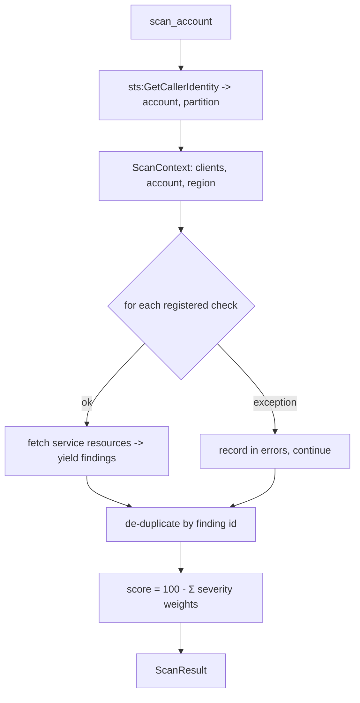

# Posture Scanner Design

## Separation of concerns: controls vs checks

The design splits *what a control means* from *how it is detected*.

- [`controls.py`](../src/endon_posture/controls.py) is the catalog: each control's ID,
  severity, Endon finding type, SCS-C03 domain, rationale and remediation. It is the
  single source of truth for meaning, and the only place a report or the benchmark refers
  to a control.
- [`checks/`](../src/endon_posture/checks) is detection: one module per service, each a
  function `(ScanContext) -> Iterator[Finding]` that fetches resources and yields a
  finding (citing a control ID) per violation.

This keeps 26 controls across 8 services legible, and lets the benchmark reason about
coverage in terms of control IDs rather than code.

## Scan flow

A check that raises (missing permission, service not enabled, an API moto doesn't
implement) is caught, recorded in `ScanResult.errors`, and the scan continues. Partial
results are better than none for a posture tool.

## How the tricky checks decide

**S3 public exposure (S3-001).** Public = `(public ACL OR wildcard-principal policy) AND
NOT (Block Public Access fully enabled)`. BPA is modelled as the override it is, so a
public ACL that BPA already neutralizes is not reported as an active exposure (though
BPA-not-fully-on is its own finding, S3-002). A wildcard policy narrowed by a `Condition`
is not treated as public.

**Security groups (EC2-001/002/003).** Each ingress permission open to `0.0.0.0/0` or
`::/0` is decoded:

| Permission | Control |
|---|---|
| `IpProtocol: -1` (all protocols) | EC2-003 (all ports) — the specific SSH/RDP controls are suppressed |
| TCP range covering 22 | EC2-001 (SSH) |
| TCP range covering 3389 | EC2-002 (RDP) |
| scoped CIDR (e.g. 10.0.0.0/8) | none |

**Region correctness.** Buckets are scanned in their home region only; IAM (global) is
evaluated once in `us-east-1`; a multi-region CloudTrail trail is judged in its home
region. This prevents the same issue being reported once per region in a real multi-region
deployment.

## Scoring

`score = max(0, 100 - Σ weights)` with CRITICAL 25, HIGH 10, MEDIUM 3, LOW 1. A blunt
headline; the findings carry the detail. Identical weights to the IAM analyzer, so scores
are comparable across Endon tools.

## Permission model

The scanner's role is read-only across audited services (S3, EC2, RDS, CloudTrail, KMS,
IAM, GuardDuty, Config) — every action a `Describe`/`Get`/`List`. It additionally has
`events:PutEvents` to the Endon bus, `s3:PutObject` scoped to the evidence bucket, and
`kms` for that bucket's key. The [infrastructure test](../../tests/test_posture_scanner_infrastructure.py)
asserts that no statement granting on `Resource: "*"` includes a mutating action on any
audited service.

## The benchmark

`tests/posture_testkit.build_vulnerable_environment(clients)` creates resources through
the real AWS APIs and returns a `Manifest` of the control IDs each planted issue should
trigger, plus the ARNs of intentionally-clean resources. The benchmark test then asserts:

- every planted control appears in the scan (detection rate = 1.0), and
- no clean resource appears in any finding (no false positives).

Because the demo (`offline_scan.py`) and the test share this testkit, the "26/26" figure
in the evidence is the same one CI enforces.
