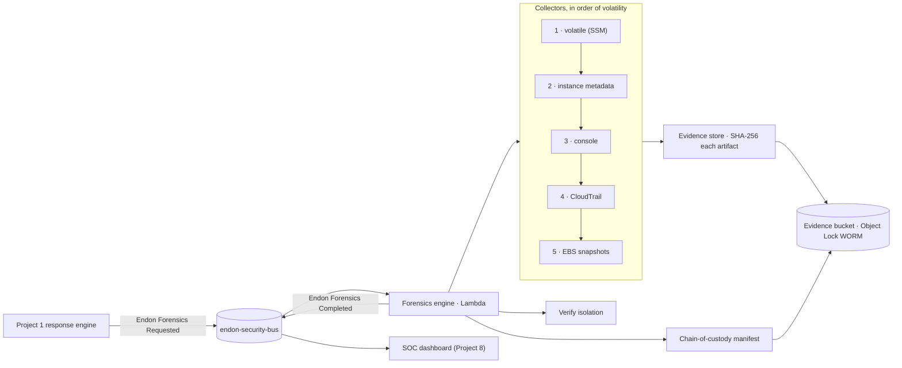

# Project 4 · Automated EC2 Incident Response & Forensics

> Part of the [Endon AI](../README.md) platform · **Status: built and tested** · event-driven Lambda

When the Project 1 response engine isolates a compromised EC2 instance, this component
takes over: it collects evidence **in order of volatility**, hashes every artifact, and
writes an immutable, timestamped chain-of-custody manifest to the Object Lock evidence
bucket — without ever terminating the instance. Containment that preserves evidence.

---

## The Security Problem

When an EC2 instance is compromised, the instinct is to terminate it and move on. That
destroys exactly what an investigation needs: the memory, running processes, disk contents
and network state that explain *what happened*. And doing forensics by hand, under
pressure, at 3am, is slow and error-prone — snapshots forgotten, timestamps lost, no
record of who touched what.

Project 1 already does the hard part of containment (isolate, don't terminate). But
containment without evidence collection leaves the investigation empty, and evidence
collected without integrity — unhashed, mutable, undocumented — is not defensible.

**Goal:** the moment an instance is isolated, automatically collect a complete, hashed,
immutable evidence package with a chain of custody, in the correct forensic order, and
prove it can never be tampered with or deleted.

## Threat Model

Full model: [architecture/threat-model.md](architecture/threat-model.md).

| Concern | Control |
|---|---|
| Terminating the host destroys volatile evidence | The engine never stops or terminates the instance; an IAM deny makes it impossible |
| Evidence altered or deleted after collection | Every artifact is SHA-256 hashed and stored under S3 Object Lock (WORM) + versioning + KMS; the role is denied `s3:DeleteObject` and `s3:BypassGovernanceRetention` |
| The forensics tool itself is abused | Read-only + snapshot-only permissions; explicit deny on all destructive EC2 and S3 actions |
| A collector failing loses the whole case | Each collector is isolated; a failure is recorded and the rest still run |
| A re-delivered request re-snapshots everything | Idempotent: a case with an existing manifest is not re-collected |

## Architecture



| Module | Responsibility |
|---|---|
| [`engine.py`](src/endon_forensics/engine.py) | Orchestrates collectors in volatility order, builds the case, writes the manifest, publishes completion |
| [`collectors/`](src/endon_forensics/collectors) | volatile (SSM), metadata, console, cloudtrail, EBS snapshots |
| [`isolation.py`](src/endon_forensics/isolation.py) | Verifies (never changes) the containment state |
| [`evidence_store.py`](src/endon_forensics/evidence_store.py) | Hashes and writes artifacts + manifest to the Object Lock bucket |
| [`models.py`](src/endon_forensics/models.py) | The forensic case, evidence items and the manifest |
| [`infrastructure/`](infrastructure/forensics_stack.py) | Lambda subscribed to the forensics request, with a preserve-only IAM role |

## Order of volatility

The collectors run most-perishable-first — the classic forensic principle, so the evidence
most likely to disappear is secured before the evidence that persists:

1. **Volatile state** (SSM): processes, network connections, sessions, cron. *Most volatile.*
2. **Instance metadata**: configuration, network interfaces, IAM profile, attached volumes.
3. **Console output** and screenshot.
4. **CloudTrail events** referencing the instance — the attacker's API trail.
5. **EBS snapshots** of every attached volume — the disk. *Least volatile.*

### The isolation vs. live-response trade-off

A properly isolated instance (moved to a no-traffic security group) **cannot reach the SSM
endpoints**, so volatile in-memory collection is impossible without relaxing the isolation.
This is a real forensic decision, and the engine is honest about it: when the host is not
reachable via SSM, volatile collection is recorded as `SKIPPED` with the reason — an
explicit gap in the evidence, never silently omitted. To enable live response, the
quarantine security group must allow egress to the SSM VPC endpoints only.

## Chain of custody

Every artifact gets a SHA-256 at collection time, stored both in the record and as S3
object metadata. The **manifest** (`forensics/<incident-id>/manifest.json`) ties them
together: the case metadata, the collector's identity (its IAM role ARN), start/finish
timestamps, the isolation state, the full timeline, and every evidence item with its hash.
The manifest itself is hashed. Everything lands in the platform's Object Lock bucket, so it
is write-once: it cannot be altered or deleted within the retention period, by anyone.

## Attack Simulation

[attack-simulation/offline_forensics.py](attack-simulation/offline_forensics.py) puts an
instance into the state Project 1 leaves a compromised host in (isolated, termination
protection on) and runs the full collection against emulated AWS — no account needed.

```bash
python 04-ec2-incident-response/attack-simulation/offline_forensics.py
```

## Evidence

Offline collection ([full output](evidence/offline-forensics.txt)):

```text
COLLECTION TIMELINE
  +0.000s  Forensics requested - CryptoCurrency:EC2/BitcoinTool.B!DNS
  +0.793s  Isolation verified - contained
  +1.012s  volatile-data: SKIPPED   (host isolated; not SSM-reachable)
  +1.030s  instance-metadata: COLLECTED
  +1.042s  console-output: COLLECTED
  +1.303s  cloudtrail-events: SKIPPED   (LookupEvents unavailable offline)
  +1.324s  ebs-snapshots: COLLECTED

CHAIN OF CUSTODY
  Case status     : COLLECTED
  EBS snapshots   : snap-5d3318d2025e01c33
  Manifest        : s3://…/forensics/INC-TESTCASE01/manifest.json
  Manifest sha256 : 7f1de756ac662284a13286a2e5a911ff70455af2f61880aba977fda158c54def
  Object Lock     : GOVERNANCE until 2026-12-14
```

Offline, `volatile` is skipped (the host is isolated) and `cloudtrail` is skipped (moto
does not implement `LookupEvents`); both succeed in a real account. Metadata, console and
disk snapshots are collected and hashed, and the manifest is stored immutably.

## Security Decisions

1. **Isolate, never terminate.** The engine has no permission to stop, terminate or delete
   the instance, its volumes, or the snapshots it takes — enforced by an explicit IAM deny,
   verified by the [infrastructure test](../tests/test_forensics_infrastructure.py).
2. **Hash on the way in.** Integrity is established at collection time, not asserted later.
3. **Immutable by construction.** Evidence lives under Object Lock; the role cannot bypass
   governance retention or delete objects.
4. **Honest gaps.** Evidence that can't be collected (volatile state on an isolated host)
   is `SKIPPED` with a reason, so the case shows exactly what is and isn't there.
5. **Idempotent.** A re-delivered request does not re-snapshot; the existing case stands.
6. **Failure-isolated.** One collector failing never loses the rest of the evidence.

## Limitations

- **Volatile memory needs network reachability.** On a fully isolated host it is skipped;
  live response requires the quarantine SG to allow SSM VPC-endpoint egress.
- **Snapshots, not full disk images.** EBS snapshots are the AWS-native, non-disruptive
  disk-evidence mechanism; bit-for-bit imaging would require attaching the volume to a
  forensic workstation (a possible extension).
- **CloudTrail lookback is 24h and per-instance.** Deeper history lives in the Log Archive
  account (Project 6); this captures the immediate window.
- **Offline timings** are engine time against emulated APIs, not real-world latency
  (snapshots in particular are asynchronous in a real account).

## Lessons Learned

- **Containment and evidence pull in opposite directions.** The cleanest isolation (no
  network) is also the one that makes live memory collection impossible. Naming that
  trade-off explicitly, in the evidence, is more honest than pretending it away.
- **Integrity is a collection-time property, not a report-time claim.** Hashing as you
  store, into a WORM bucket, is what makes the evidence defensible.
- **A manifest is the real deliverable.** The snapshots and files are raw material; the
  chain-of-custody manifest — ordered, timestamped, hashed, attributed — is what an
  investigator or a court actually uses.

## Run It

```bash
python 04-ec2-incident-response/attack-simulation/offline_forensics.py   # offline
pytest 04-ec2-incident-response/tests                                     # tests
cdk deploy EndonForensics                                                 # deploy
```

## Project Layout

```text
04-ec2-incident-response/
├── README.md · CASE_STUDY.md · SECURITY.md
├── architecture/{architecture.md, threat-model.md}
├── src/endon_forensics/
│   ├── engine.py            orchestration
│   ├── collectors/          volatile, metadata, console, cloudtrail, snapshots
│   ├── isolation.py         verify containment
│   ├── evidence_store.py    hash + write to Object Lock
│   ├── models.py            case + manifest
│   ├── rules.py / handler.py
├── infrastructure/forensics_stack.py
├── attack-simulation/offline_forensics.py
├── evidence/
└── tests/
```
