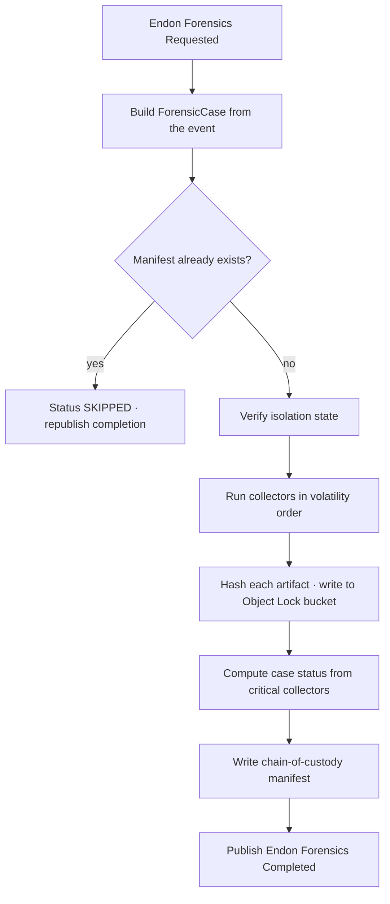
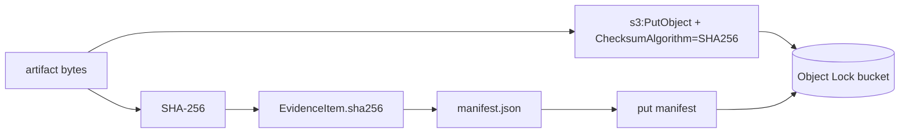

# EC2 Forensics Design

## Collection flow

## Collectors

Each collector is `(CollectorContext) -> list[EvidenceItem]`, registered with an `order`
(volatility) and a `critical` flag. The engine runs them in order, catches any exception
(recording a `FAILED` item without losing the rest), and hashes/stores whatever they
produce.

| Collector | order | critical | Evidence |
|---|---|---|---|
| `volatile-data` | 10 | no | Processes, connections, sessions, cron via SSM (skipped if unreachable) |
| `instance-metadata` | 20 | **yes** | Instance config, ENIs, IAM profile, attached volumes |
| `console-output` | 30 | no | Serial console output, screenshot where available |
| `cloudtrail-events` | 40 | no | CloudTrail events referencing the instance (24h) |
| `ebs-snapshots` | 50 | **yes** | A tagged snapshot of every attached volume |

**Case status** is derived from the critical collectors: `COLLECTED` when every critical
collector produced evidence, `PARTIAL` when a critical one is missing but something was
collected, `FAILED` when nothing was, and `SKIPPED` for an idempotent re-delivery.

## Evidence integrity

- Each artifact is hashed **before** upload; the hash is recorded in the evidence item and
  as S3 object metadata.
- The SHA-256 checksum on `PutObject` also satisfies S3 Object Lock's write-integrity
  requirement.
- The manifest lists every item with its hash, the collector identity, timestamps and the
  isolation state, then is itself hashed.
- The bucket (from the platform stack) has Object Lock (GOVERNANCE, 90 days), versioning
  and KMS encryption, so stored evidence is write-once.

## Permission model

The forensics role can inspect, snapshot and read — never destroy.

| Statement | Actions | Resources |
|---|---|---|
| `InspectInstances` | ec2 Describe*/GetConsole*, autoscaling:DescribeAutoScalingInstances | `*` (no resource-level support) |
| `SnapshotVolumesForEvidence` | ec2:CreateSnapshot(s), ec2:CreateTags | volume / snapshot / instance ARNs |
| `ReadCloudTrail` | cloudtrail:LookupEvents | `*` |
| `LiveResponseReadOnly` | ssm:DescribeInstanceInformation, SendCommand, GetCommandInvocation | instance + AWS-RunShellScript document |
| **`DenyDestructiveActions`** | Terminate/Stop instances, Delete snapshot/volume, s3:DeleteObject, s3:BypassGovernanceRetention | `*` |

Plus platform grants: put/read on the evidence bucket, the KMS key, and `events:PutEvents`.

## Reliability

| Failure | Handling |
|---|---|
| Lambda error / throttle | EventBridge retries for 6h, then the dead-letter queue + alarm |
| One collector fails | Recorded as `FAILED`; the rest still run |
| Re-delivered request | Idempotent — the existing manifest short-circuits re-collection |
| Completion event fails to publish | Logged; the stored case remains the source of truth |
