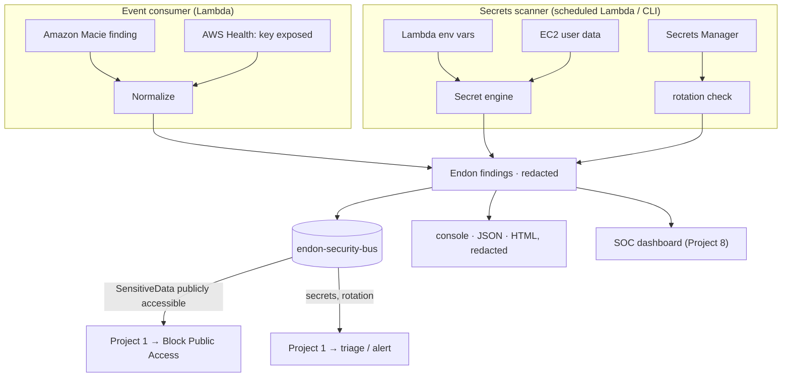

# Project 5 · Data Protection & Secrets Exposure Monitor

> Part of the [Endon AI](../README.md) platform · **Status: built and tested** · CLI, scheduled scanner + event consumer

Finds secrets where they get left in the open — Lambda environment variables, EC2 user
data, config — with a real signature-plus-entropy detection engine, and consumes Amazon
Macie sensitive-data findings. Its guiding rule: **a tool that reports secrets must never
leak one**, so every value it emits is redacted.

---

## The Security Problem

Data exposure is usually accidental. A developer drops a database password into a Lambda
environment variable, bakes an access key into an EC2 launch script, uploads a customer
export to the wrong bucket, or commits an AWS key that ends up on a public repo. None of it
is malicious, and none of it trips a threat detector — it's a *state*, sitting there until
someone finds it, and the attacker is often first.

Two problems compound it. First, secrets hide in places nobody scans (env vars, user data).
Second, a naive scanner that prints the secrets it finds becomes its *own* exposure — the
findings, the logs, the report all now contain the plaintext.

**Goal:** detect exposed secrets and sensitive data across the account, reliably enough to
act on (low false positives), and never emit a plaintext secret anywhere in the process.

## Two capabilities

| | What | Trigger |
|---|---|---|
| **Secrets scanner** | Lambda env vars, EC2 user data, Secrets Manager rotation | Scheduled + CLI |
| **Event consumer** | Amazon Macie sensitive-data findings; AWS Health credential-exposure | EventBridge |

## The detection engine

The core ([`secrets/`](src/endon_dataprotection/secrets)) is a reusable secret detector,
the counterpart to Project 2's policy engine and Project 3's control catalog:

- **Signatures** ([`patterns.py`](src/endon_dataprotection/secrets/patterns.py)) for the
  high-confidence formats: AWS access keys, private-key blocks, GitHub/Slack/Stripe/Google/
  SendGrid/Twilio tokens, JWTs, database URLs with embedded passwords.
- **Entropy** ([`entropy.py`](src/endon_dataprotection/secrets/entropy.py)): a
  secret-named variable holding a high-entropy base64/hex value is flagged even when it
  matches no signature — this is how a raw `AWS_SECRET_ACCESS_KEY` is caught.
- **Placeholder suppression**: `changeme`, `example`, `${VAR}`, `<your-key>`, references
  and repeated-character values are dropped, so what remains is worth acting on.
- **Redaction** ([`redaction.py`](src/endon_dataprotection/secrets/redaction.py)): every
  value is reduced to a few edge characters plus a short SHA-256 fingerprint
  (`AKI...E5F (sha256:a25a3da7cec3)`). The fingerprint lets an operator confirm which
  secret a finding refers to, and later confirm they rotated it, without the finding ever
  carrying the plaintext.

## Architecture



## Macie: the classification path

Macie tells us *what* sensitive data a bucket holds and whether the bucket is public. The
important escalation is the combination: **sensitive data that is also publicly accessible**
becomes `DataProtection:S3/SensitiveDataPubliclyAccessible` (CRITICAL), which routes to the
Project 1 `s3-public-exposure` playbook for automatic Block Public Access — the same seam
the posture scanner uses. Sensitive data that is private is reported for review, with
severity from the data categories (credentials/financial → HIGH, personal → MEDIUM).

AWS Health `AWS_RISK_CREDENTIALS_EXPOSED` (the "your key is on GitHub" event) becomes a
CRITICAL `DataProtection:IAM/CredentialsExposed` finding.

## Attack Simulation

[attack-simulation/offline_scan.py](attack-simulation/offline_scan.py) plants secrets in a
Lambda's environment, an EC2 instance's user data, and an unrotated secret, then scans —
all offline. It ends with a redaction check that fails loudly if any plaintext appears.

```bash
python 05-data-protection-monitor/attack-simulation/offline_scan.py
```

## Evidence

Offline scan ([full output](evidence/offline-scan.txt)):

```text
CRITICAL [DP-EC2-001] Secret in EC2 user data: i-…
  2 secret(s): AWS access key id: AKI...E5F (sha256:a25a3da7cec3);
               Private key block: ---...--- (sha256:03d104c669e3)
HIGH     [DP-LAMBDA-001] Secret in Lambda environment variables: checkout
  2 secret(s): Database URL with password: pR0...z9x (sha256:3f1fa0c3cde5);
               GitHub token: ghp...7r8 (sha256:620e24b63197)
MEDIUM   [DP-SM-001] Secrets Manager secret has rotation disabled: prod/db-password

REDACTION CHECK
  Raw secrets in the report: 0 (must be 0)
```

## Security Decisions

1. **Never emit a secret.** Redaction happens inside the engine; findings, reports, logs
   and events carry only the redacted token. Tests assert no planted plaintext ever appears
   in any output.
2. **Never *read* a secret's value.** The scanner role has `secretsmanager:ListSecrets` but
   not `GetSecretValue` — reading secret plaintext would make the monitor an exfiltration
   path. The [infrastructure test](../tests/test_data_protection_infrastructure.py) fails if
   that permission is ever granted.
3. **Detect, remediate one thing.** Only public sensitive data is auto-remediated (by
   Project 1). Exposed secrets are reported for a human to rotate — the tool can't safely
   guess how to rotate someone's credential.
4. **Low false positives on purpose.** Placeholder suppression and the secret-named-variable
   gate keep the entropy path from crying wolf on build IDs and config values.

## Limitations

- **Config surfaces, not object contents.** The scanner reads env vars, user data and
  Secrets Manager metadata. It does not read S3 object *contents* for sensitive data — that
  is Macie's job, and this component consumes Macie's findings instead.
- **Signatures lag new formats.** New vendor token formats need new signatures; the entropy
  path is the safety net but is deliberately conservative.
- **Macie must be enabled** for the classification path (the Project 6 landing zone does
  this org-wide). Offline, Macie is replayed from a representative event.
- **Exposed-key auto-disable is not automated** here — it is reported CRITICAL. Auto-disable
  belongs to Project 1's containment, gated behind AWS-source trust.

## Lessons Learned

- **The scanner is a data-protection risk itself.** The hardest design constraint wasn't
  detection — it was making sure the tool that finds secrets never becomes the place they
  leak. Redaction at the engine boundary, and no permission to read secret values, are both
  expressions of that.
- **Entropy needs a gate.** High entropy alone flags every hash and build ID. Pairing it
  with a secret-looking variable name is what makes it usable.
- **The interesting finding is a combination again.** Sensitive data is a MEDIUM; sensitive
  data *plus* public access is a CRITICAL that fixes itself — the value is in the join.

## Run It

```bash
python 05-data-protection-monitor/attack-simulation/offline_scan.py   # offline
pytest 05-data-protection-monitor/tests                                # tests
endon-data-protection scan --region us-east-1 --formats console,html --output-dir reports/
endon-data-protection scan --region us-east-1 --fail-on HIGH           # CI gate
cdk deploy EndonDataProtection                                         # deploy
```

## Project Layout

```text
05-data-protection-monitor/
├── README.md · CASE_STUDY.md · SECURITY.md
├── architecture/{architecture.md, threat-model.md}
├── src/endon_dataprotection/
│   ├── secrets/            the detection engine (patterns, entropy, redaction, scanner)
│   ├── scanners/           lambda_env, ec2_userdata, secretsmanager
│   ├── normalizers.py      Macie + AWS Health -> Endon findings
│   ├── scanner.py          orchestration + score
│   ├── reporting/          console, json, html (all redacted)
│   ├── publish.py / rules.py / handler.py / cli.py
├── infrastructure/data_protection_stack.py
├── attack-simulation/offline_scan.py
├── evidence/
└── tests/
```
