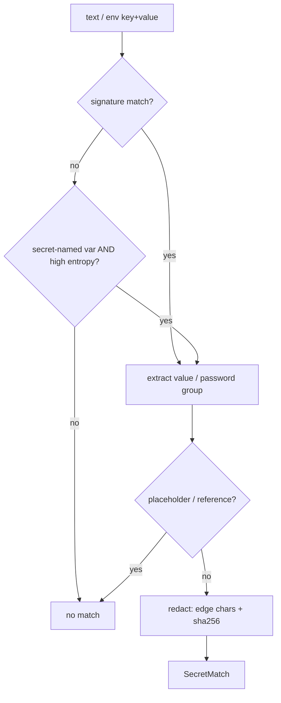
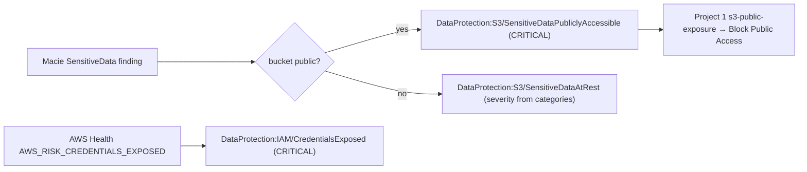

# Data Protection Monitor Design

## The detection engine

[`secrets/`](../src/endon_dataprotection/secrets) is a self-contained secret detector with
three layers and a hard redaction boundary.

| Layer | File | Role |
|---|---|---|
| Signatures | `patterns.py` | High-confidence vendor formats; a group index says which capture is the secret |
| Entropy | `entropy.py` | Shannon entropy + charset + length gate for unknown-format secrets |
| Suppression | `scanner.py` | Placeholders, references, repeated-char values dropped |
| Redaction | `redaction.py` | Every emitted value is `xxx...yyy (sha256:…)` — irreversible |

`scan_text` runs signatures over free text; `scan_env` adds the entropy path for a
secret-named variable; `scan_mapping` walks a whole environment. Redaction is applied
inside the engine, so nothing downstream can accidentally emit plaintext.

## From matches to findings

The config scanners ([`scanners/`](../src/endon_dataprotection/scanners)) turn matches into
Endon findings:

| Scanner | Reads | Finding type |
|---|---|---|
| `lambda_env` | `ListFunctions` + env vars | `DataProtection:Lambda/SecretInEnvironment` |
| `ec2_userdata` | `DescribeInstanceAttribute(userData)` | `DataProtection:EC2/SecretInUserData` |
| `secretsmanager` | `ListSecrets` (metadata only) | `DataProtection:SecretsManager/RotationDisabled` |

The finding's severity is the worst secret it contains; its description lists the redacted
matches. `DataProtectionScanner` runs all scanners, tolerates a failing one, and scores the
account (same weights as the other Endon scanners).

## The Macie / Health path

[`normalizers.py`](../src/endon_dataprotection/normalizers.py) converts external events:

## Permission model

Two Lambdas, both read-only where they inspect:

| Role | Allowed | Notably *not* allowed |
|---|---|---|
| Scanner | `lambda:ListFunctions/GetFunctionConfiguration`, `ec2:DescribeInstances/DescribeInstanceAttribute`, `secretsmanager:ListSecrets`, `macie2:Get/ListFindings` | `secretsmanager:GetSecretValue` — never reads a secret's value |
| Event consumer | `macie2:Get/ListFindings`, `events:PutEvents` | any write to inspected resources |

Plus platform grants: `events:PutEvents` to the bus, `s3:PutObject` to the evidence bucket
(scanner report), and the KMS key. The infrastructure test asserts the read-only surface
and the absence of `GetSecretValue`.

## Why the monitor can't leak

Two independent controls:

1. **Redaction at the engine boundary** — the plaintext never leaves `secrets/`, so no
   finding, report, log line or event can carry it.
2. **No permission to read secret values** — even the Secrets Manager check reads only
   metadata (`ListSecrets`), so the monitor has no path to a plaintext it would then have to
   be trusted to redact.
