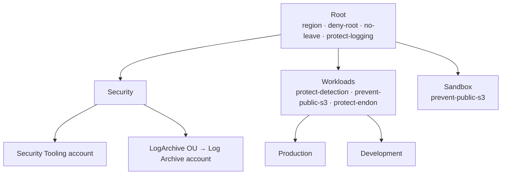
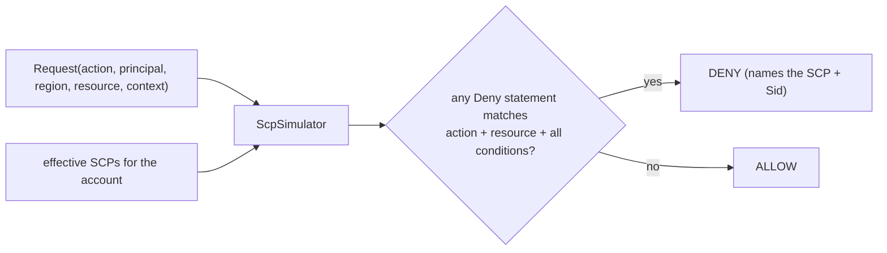

# Landing Zone Design

## SCPs as the control plane

An IAM policy grants permissions inside an account; a Service Control Policy sets the
*ceiling* for the whole account. The evaluation order is: a request is allowed only if it is
permitted by SCPs at every level from the root down **and** by IAM. An explicit `Deny` in
any attached SCP wins over everything, including an account administrator and the account
root user. That is why guardrails belong here.

The guardrails are **deny-based over the default `FullAWSAccess`**: the org keeps the
default allow-all SCP, and each guardrail adds targeted denies. This is simpler and safer
than allow-list SCPs (which deny by omission and are easy to get wrong).

## Structure and inheritance

`Organization.effective_scps(ou)` computes the union of SCPs along the path to the root, so
`Production` inherits the Root guardrails plus the Workloads guardrails. The CDK stack
relies on AWS's own inheritance (an SCP attached to the Workloads OU applies to Production
and Development automatically), so it attaches to OUs, not individual accounts.

## The simulator

For each attached SCP, the simulator checks every `Deny` statement:

- **Action**: `Action` patterns (or `NotAction` for the region lock) matched with wildcards.
- **Resource**: `*` or ARN-pattern match against the request's resource (used by the Endon-
  platform guardrail).
- **Conditions**: all operators must hold —
  - `ArnNotLike`/`ArnLike` on `aws:PrincipalArn` (the security-admin and deploy-role exemptions),
  - `StringNotEquals`/`StringEquals` on `aws:RequestedRegion` (the region lock),
  - `StringEquals`/`StringLike` on other keys (e.g. `s3:x-amz-acl`).

A missing condition key resolves the "Not" operators to true and the positive operators to
false, matching how IAM treats absent keys for these operators.

## Permission model

This stack runs in the management account and creates organization resources; it has no
runtime IAM role of its own beyond the CloudFormation execution role. The controls it
deploys are policy, not compute.

## What the CDK stack creates

| Resource | Purpose |
|---|---|
| `AWS::Organizations::OrganizationalUnit` ×6 | Security, LogArchive, Workloads, Production, Development, Sandbox |
| `AWS::Organizations::Policy` ×N | one per catalog SCP, attached via `TargetIds` |
| `AWS::S3::Bucket` (Object Lock) | the Log Archive bucket for the org trail |
| `AWS::CloudTrail::Trail` (org, multi-region, validated) | the organization audit trail |

The synth test asserts the OU count, one policy per catalog SCP with the exact document,
and the org trail + Object Lock bucket properties, so the deployed guardrails are the same
documents the simulator proves.
