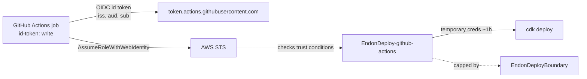
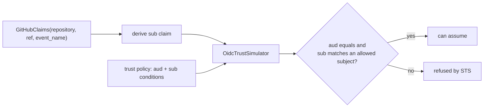
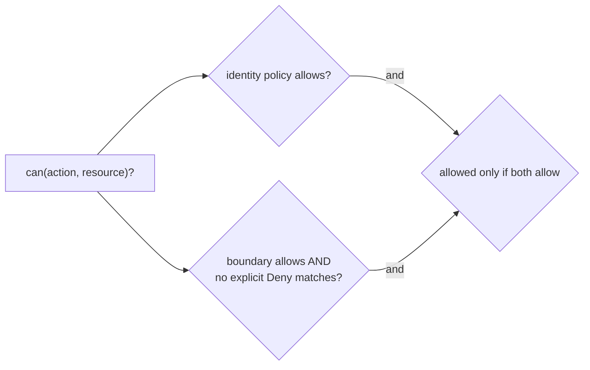

# Passwordless CI/CD Design

## Keyless federation, end to end

There is no AWS secret in GitHub. A deploy obtains credentials by exchanging a GitHub-issued
identity token for temporary AWS credentials:

The AWS account has a GitHub **OIDC identity provider** (`token.actions.githubusercontent.com`,
audience `sts.amazonaws.com`). STS validates the token's signature, issuer, and expiry, then
checks the deploy role's trust policy conditions before issuing credentials. The credentials
are short-lived; nothing static is ever stored.

## The trust policy — who can assume the role

The role trusts the OIDC provider through `sts:AssumeRoleWithWebIdentity` with two conditions:

| Claim | Operator | Value | Purpose |
|---|---|---|---|
| `...:aud` | StringEquals | `sts.amazonaws.com` | token was minted for AWS STS |
| `...:sub` | StringLike | `repo:<owner>/<repo>:ref:refs/heads/main` | this repo, this branch only |

GitHub sets `sub` from the run's context: `repo:owner/name:ref:refs/heads/<branch>` for a
branch push, `repo:owner/name:pull_request` for a PR, `repo:owner/name:ref:refs/tags/<tag>` for
a tag, and the repository is the *actual* owner/name — a fork carries the fork's owner. Because
each of those is a different string, only a push to `main` of the exact repository matches, and
STS refuses everything else.

[`oidc.py`](../src/endon_pipeline/oidc.py) is the single source of truth: `GitHubOidcConfig.
allowed_subjects()` produces the `sub` patterns, `build_trust_policy()` builds the policy the
CDK stack deploys, and `OidcTrustSimulator` evaluates candidate claims against that same policy.

## The permissions boundary — what the role can do

Two policies decide the deploy role's blast radius, and a request must pass **both**:

- **Identity policy** — grants only `sts:AssumeRole` on `arn:aws:iam::*:role/cdk-*` (the CDK
  bootstrap roles). That is the entire legitimate job.
- **Permissions boundary** (`EndonDeployBoundary`) — allows the deployment surface
  (`cloudformation:*`, `s3:*`, `sts:*`, `ssm:*`, `ecr:*` within CDK's needs) and **explicitly
  denies** the escalation and destruction set: `iam:CreateUser`, `iam:CreateAccessKey`,
  `iam:CreateLoginProfile`, `iam:Attach*Policy`, `iam:Put*Policy`, `iam:CreatePolicyVersion`,
  `iam:PassRole`, `iam:*RolePermissionsBoundary`, `organizations:*`, `account:*`,
  `s3:DeleteBucket`, `dynamodb:DeleteTable`, `kms:ScheduleKeyDeletion`.

Because an explicit `Deny` overrides any `Allow`, `DeployRoleModel.can()` returns false for
those actions **even if the identity policy is replaced with `Allow *`** — which is precisely
the compromised-pipeline case. [`boundary.py`](../src/endon_pipeline/boundary.py) builds both
policies and the model; it reuses Project 2's `PolicyDocument`/`PermissionSet` evaluator so the
deny-wins semantics are the same ones the IAM analyzer uses.

## Security gates in the pipeline

The workflow runs two of the platform's own scanners as blocking gates:

| Gate | Source | Fails the build on | When |
|---|---|---|---|
| IAM analysis | Project 2 (`IamAnalyzer`) | any `CRITICAL` finding | before deploy |
| Posture scan | Project 3 (`PostureScanner`) | any `HIGH` finding | after deploy |

[`gate.py`](../src/endon_pipeline/gate.py) runs each against the live account (via the assumed
role's credentials) and returns a `GateResult`; the CLI exits non-zero to stop the run.

## What the CDK stack creates

| Resource | Purpose |
|---|---|
| `Custom::AWSCDKOpenIdConnectProvider` | the GitHub OIDC identity provider (`aud sts.amazonaws.com`) |
| `AWS::IAM::ManagedPolicy` (`EndonDeployBoundary`) | the permissions boundary |
| `AWS::IAM::Role` (`EndonDeploy-github-actions`) | web-identity trust + boundary + assume-only identity policy |

The [synth test](../../tests/test_pipeline_infrastructure.py) asserts the provider, the
web-identity trust with the `aud`/`sub` conditions, the attached boundary, the denied
escalation actions, and that the identity policy grants nothing but `sts:AssumeRole` — so the
deployed role is the same one the simulator proves.
