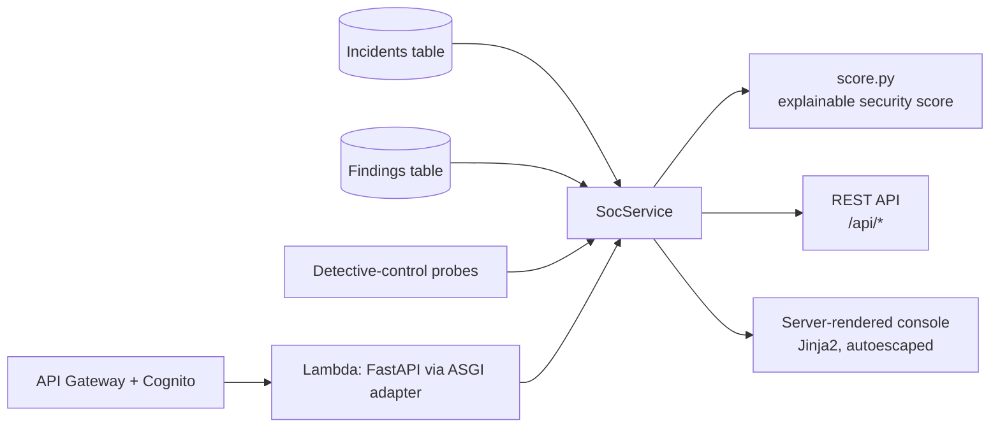
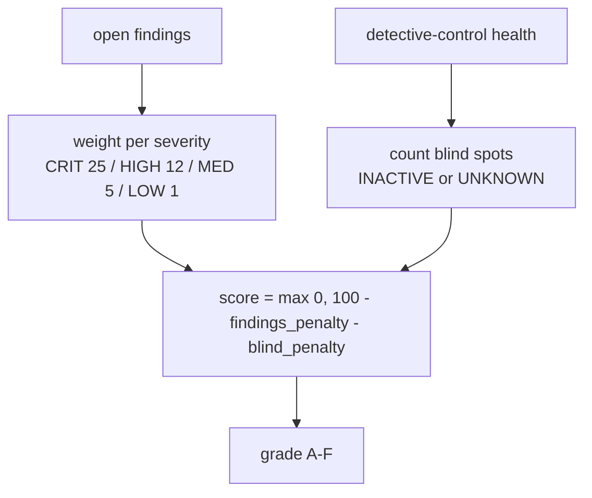
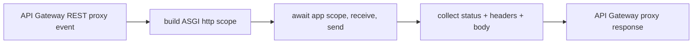

# SOC Design

## One read-model, two views

The SOC is a thin, read-only layer over the platform's stores. The API and the HTML console are
two renderings of the same `SocService`; nothing else holds state.

`SocService` reads the same `endon_core` `Incident` and `Finding` records that Projects 1-5
write. There is no SOC-specific schema and no direct coupling to any component — the stores are
the contract.

## The security score

The score is a pure function ([`score.py`](../src/endon_soc/score.py)):

- **Super-linear severity weights** so severity dominates volume — one CRITICAL (25) outranks
  twenty LOWs (20). The score should react to what can get you owned, not to noise.
- **A blind-spot penalty** (12 per disabled detector) so a findings-only score can't look green
  on top of a switched-off detector.
- **Floors at 0**, and every deduction is reported (`findings_penalty`, `blind_penalty`) so the
  number is explainable, not a black box.

## Detective-control health, fail-safe

[`health.py`](../src/endon_soc/health.py) probes GuardDuty, Security Hub, CloudTrail and Config
with read-only calls. Each probe returns `ACTIVE`, `INACTIVE` or `UNKNOWN`, and only a confirmed
`ACTIVE` counts as coverage — an error (permissions, unsupported region, offline) yields
`UNKNOWN`, which scores as a blind spot. The SOC never reports coverage it cannot confirm.

## Read-only, enforced

| Layer | Control |
|---|---|
| Application | `SocService` exposes only reads; the API has no mutating verb |
| IAM | `grant_read_data` on both tables (get/query/scan; no put/update/delete) |
| Test | [`test_soc_infrastructure.py`](../../tests/test_soc_infrastructure.py) fails if any DynamoDB write action is granted |

## Authentication

Every API Gateway method carries a Cognito user-pool authorizer; the user pool requires MFA and
disables self-sign-up. The synth test asserts `AuthorizationType: COGNITO_USER_POOLS` on every
method, so no route can be deployed unauthenticated.

## The ASGI → Lambda adapter

Rather than add an ASGI framework to the deployment bundle, the SOC ships a ~40-line adapter
([`lambda_handler.py`](../src/endon_soc/lambda_handler.py)):

It maps the proxy event (method, path, query, headers, body) to an ASGI `http` scope, drives
the app to completion with a one-shot `receive` and a collecting `send`, and maps the response
back. This keeps the Lambda bundle to Endon's own packages plus the runtime's boto3, and the
adapter is unit-tested against the app with no AWS.

## What the CDK stack creates

| Resource | Purpose |
|---|---|
| `AWS::Cognito::UserPool` + client | Authentication (MFA, invite-only) |
| `AWS::ApiGateway::RestApi` (+ Cognito authorizer on every method) | The gated HTTP surface |
| `AWS::Lambda::Function` | The FastAPI app via the ASGI adapter, read-only on the tables |
| `AWS::CloudWatch::Alarm` | Alerts to the platform SNS topic on app errors |

The Lambda's environment points at the platform's `ENDON_INCIDENTS_TABLE` and
`ENDON_FINDINGS_TABLE`, so it reads exactly the records the rest of the platform writes.
