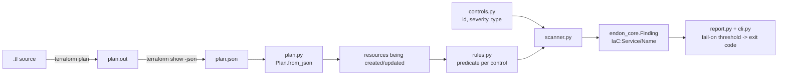
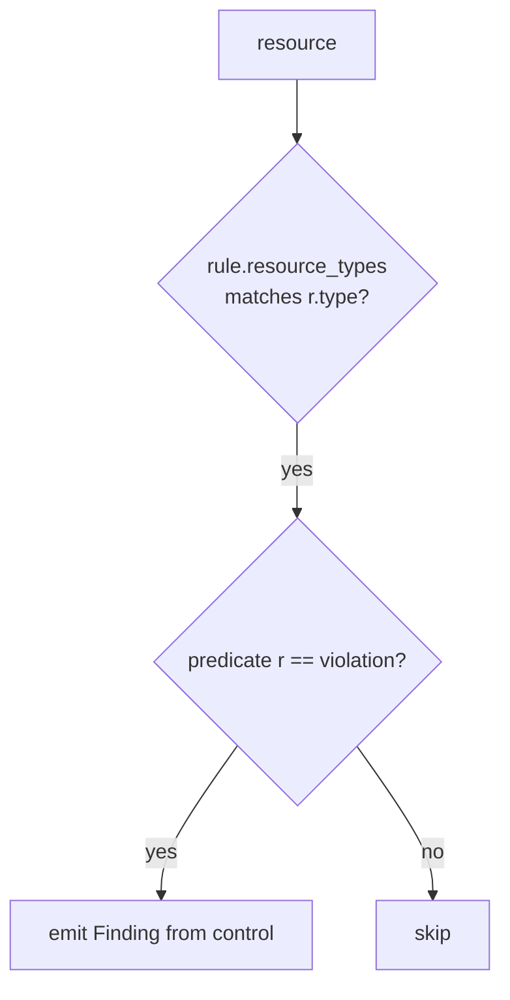
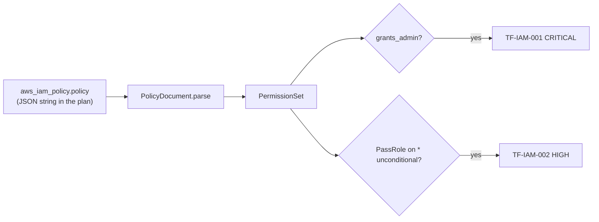

# Terraform Scanner Design

## The pipeline: plan in, findings out

Terraform does the hard part — resolving variables, modules and defaults into a concrete plan.
The scanner reads that plan as JSON, so every rule sees a real attribute value.

## Parsing (`plan.py`)

`terraform show -json` produces a document with a `resource_changes` array. Each entry has an
`address`, a `type`, and a `change` block with `actions` and the post-apply config in
`change.after`. `Plan.from_json`:

- keeps **managed** resources (skips `data` sources),
- drops resources whose only action is `delete` or `no-op` (nothing is being created), and
- exposes each as a `Resource(address, type, values, ...)` with `get()` for scalars and
  `blocks()` for nested blocks (Terraform renders `ingress {}` etc. as JSON arrays).

## Rules and controls

`controls.py` is the catalog — each control has a stable id, severity, `IaC:<Service>/<Name>`
finding type, domain and remediation. `rules.py` is detection — a `Rule(control_id,
resource_types, predicate)` where the predicate returns `True` on a violation. The scanner
applies each rule to the resources of its types:

Splitting the two means a new check is one predicate plus one catalog entry, each unit-tested
in isolation.

## Reusing Project 2 for IAM

The two IAM rules don't re-implement policy analysis. They pull the policy JSON string out of
the plan, `json.loads` it, and hand it to Project 2's engine:

One definition of "administrator-equivalent," shared between the live IAM analyzer and the
Terraform scanner.

## Output and the gate

The scanner emits `endon_core.Finding` objects (source `endon.tfscan`, type `IaC:...`), so
results convert to ASFF and travel the platform like any other finding. `report.evaluate_gate`
counts findings at or above the `--fail-on` severity; `cli.py` prints the board or JSON and
returns a non-zero exit code when any block, which is what makes it a CI gate.

## Testing without Terraform

The committed `terraform/plans/*.json` are real `terraform show -json` output. Tests load them
directly, so the full scanner runs in CI in milliseconds with no Terraform binary — the same
hermetic, offline discipline the moto-backed projects use, applied to Terraform.
