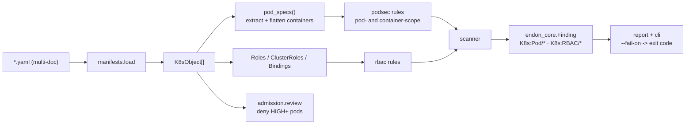
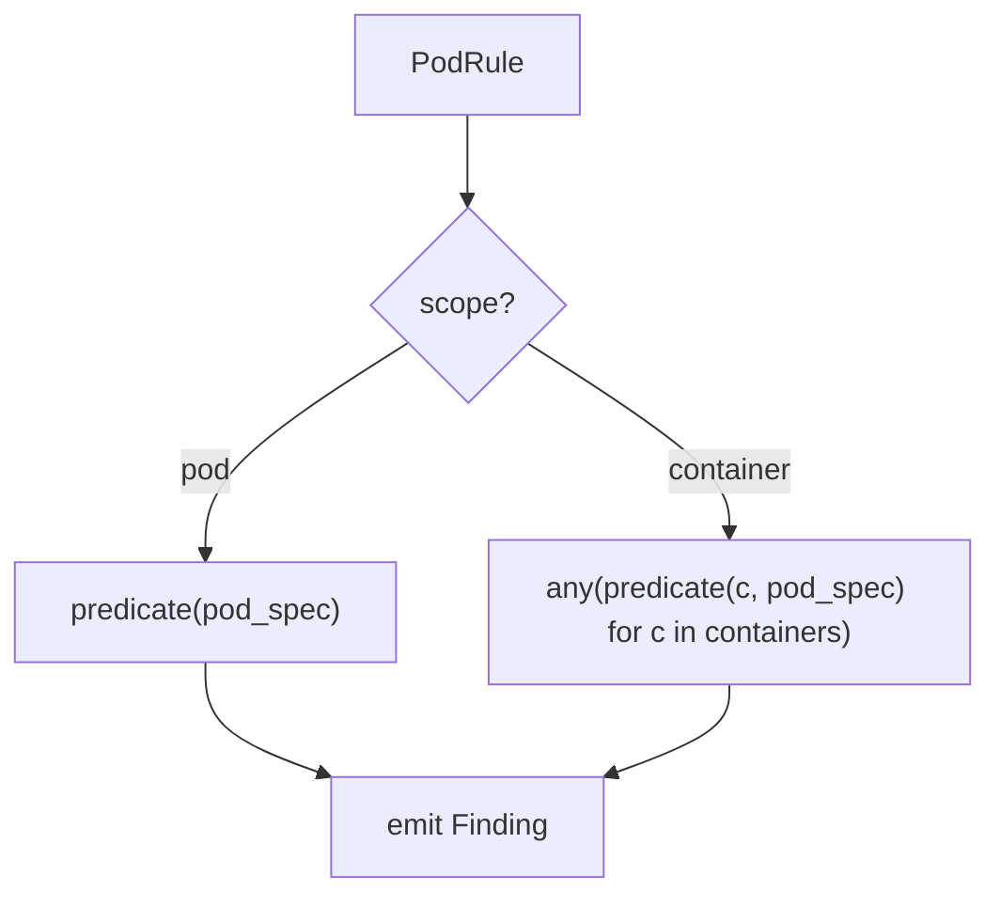
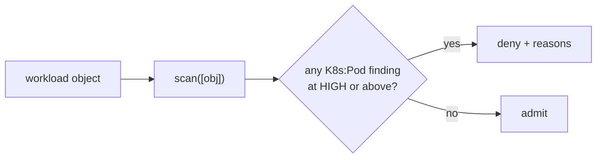

# Kubernetes Security Design

## Manifests in, findings out

## Normalizing workloads (`manifests.py`)

Every workload runs a pod spec, just at a different depth: a `Pod` has `spec`, a `Deployment`
has `spec.template.spec`, a `CronJob` has `spec.jobTemplate.spec.template.spec`. `pod_specs()`
knows each path, pulls out the spec, and flattens `initContainers + containers` so a
container-scope rule never has to care which workload wrapped the pod.

## Pod rules have a scope (`podsec.py`)

Some checks are about the pod (host namespaces, `hostPath` volumes, the service-account token);
some are about a container (privileged, capabilities, limits, the image). Each `PodRule`
declares `scope = "pod"` or `"container"`, and the scanner evaluates pod rules once and
container rules against every container:

## RBAC mirrors Project 2 (`rbac.py`)

RBAC is the cluster's IAM. The analyzer reads a Role/ClusterRole's `rules[]` (verbs × resources
× apiGroups) and flags the dangerous grants — wildcard, Secret reads, Pod creation, `bind`/
`escalate`, `pods/exec` — and reads a binding's `roleRef` to catch `cluster-admin`. It is the
same idea as Project 2's IAM analysis, applied to Kubernetes' permission model.

## Admission control, simulated (`admission.py`)

`review(obj)` runs the scanner on a single object and denies the pod if any blocking pod-security
finding fires — exactly the decision a validating webhook makes. It shares the scanner's rules,
so what CI reports and what the cluster enforces can't diverge. The Kyverno ClusterPolicies in
`policies/` are the deployable version of the same intent; the simulator is how the policy is
tested before it reaches a cluster.

## Output and the gate

Findings are `endon_core.Finding` (source `endon.k8s`, type `K8s:...`), so they convert to ASFF
and travel the platform like any other finding. `endon-k8s scan --fail-on HIGH` returns a
non-zero exit code when any block, making it a CI gate; `endon-k8s admit` returns non-zero if any
pod would be rejected. Tests load the committed manifest fixtures, so the whole thing runs in CI
in milliseconds with no cluster.
