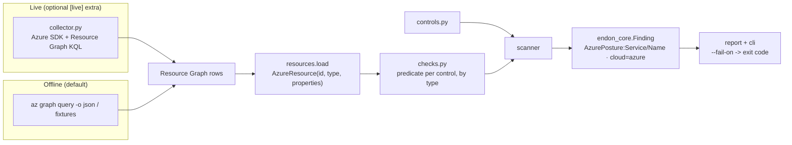
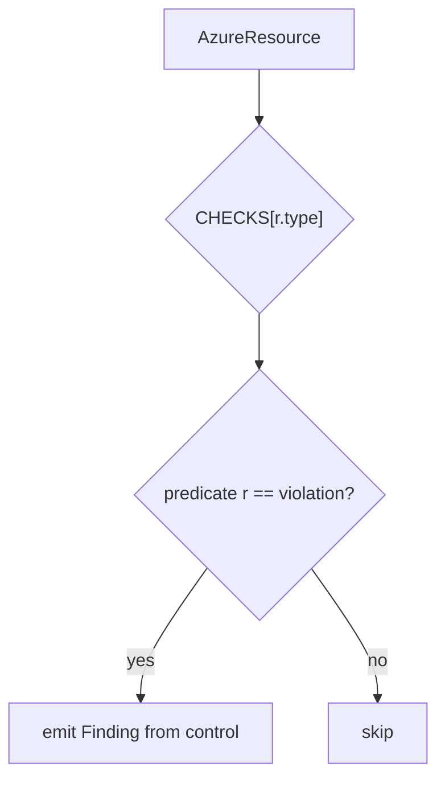

# Azure Posture Design

## Resources in, findings out

The scanner never talks to Azure. The only Azure-aware code is the collector, and it is a lazy
import behind an optional extra — so the checks and the tests run on JSON alone.

## Normalizing (`resources.py`)

Azure Resource Graph returns rows with `id`, a `type` like `Microsoft.Storage/storageAccounts`,
a `location`, a `resourceGroup` and a `properties` object. `AzureResource` lower-cases the type
(so matching is stable) and exposes `prop("a.b.c")` for dotted lookups into `properties`. The
loader accepts either a bare list or a Resource Graph `{ "data": [...] }` envelope.

## Checks are indexed by resource type (`checks.py`)

Each control is a `Check(control_id, predicate)`, and checks are grouped by the Azure resource
type they apply to. The scanner only runs a resource against the checks for its type:

That keeps a Storage check from ever seeing a Key Vault, and makes adding a service a matter of
one catalog entry and one predicate.

## Live collection (`collector.py`)

`collect(subscription_ids)` issues one Resource Graph query for exactly the resource types the
checks assess, pages through `skip_token`, and returns rows already shaped like the fixtures.
This mirrors production CSPM: inventory the subscription with one graph query rather than
per-service API walks. It uses `DefaultAzureCredential`, so it runs under `az login`, a managed
identity, or a service principal, and needs only read access.

## Output and the gate

Findings are `endon_core.Finding` (source `endon.azure`, type `AzurePosture:...`, tag
`cloud=azure`), so they convert to ASFF and reach the SOC beside AWS findings. `endon-azure scan
--fail-on HIGH` returns a non-zero exit code when any block, so it gates the pipeline exactly
like the AWS and Terraform scanners. Tests load the committed JSON fixtures — no Azure, no SDK,
milliseconds.
