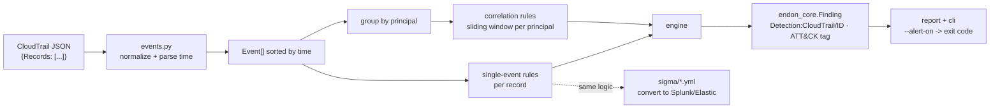
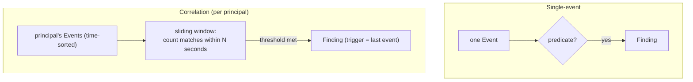

# Log Detection Design

## Stream in, detections out

## Normalizing (`events.py`)

CloudTrail nests who/what/where differently per service. `Event` flattens each record to
`time, name, source, region, source_ip, error_code, identity_type, principal, request_parameters`
— and crucially parses `eventTime` into a real `datetime`, so the correlation rules can measure
windows. `principal` resolves who acted: the ARN, else the user/role name, else the account (with
a `root:` prefix for the root user, so root activity groups on its own).

## Two rule shapes (`detections.py`)

`_window_hit(events, match, count, seconds, key)` is the correlation primitive: it walks the
matching events keeping a deque within `seconds`, and fires when the window holds `count` matches
(or `count` distinct `key` values, e.g. distinct source IPs). Mass download counts events;
multiple-IPs counts distinct IPs; reconnaissance counts distinct API names.

## The engine (`engine.py`)

Single-event rules run over every record; correlation rules run over each principal's timeline.
Findings are `endon_core.Finding` — source `endon.siem`, type `Detection:CloudTrail/<id>`, tagged
with the ATT&CK technique and `first_observed_at` set from the triggering event — so they convert
to ASFF and reach the SOC beside GuardDuty findings. The list is sorted most-severe first, then by
time.

## Portability (`sigma/`)

The single-event detections are also written as Sigma rules — the vendor-neutral format that
`sigma convert` turns into Splunk SPL, Elastic EQL, and more. The engine is the offline proof and
the platform integration; Sigma is the deployment into an existing SIEM. Same detection, two forms,
kept in step.

## Testing without a cloud

Tests replay committed CloudTrail fixtures — an attack log and a benign log — so the whole engine,
including the windowed correlation, runs in CI in milliseconds. The benchmark asserts every
detection fires on the attack and none on the benign day, the same measured-coverage discipline the
posture and Terraform scanners use.
