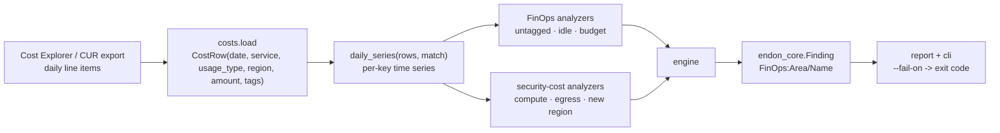
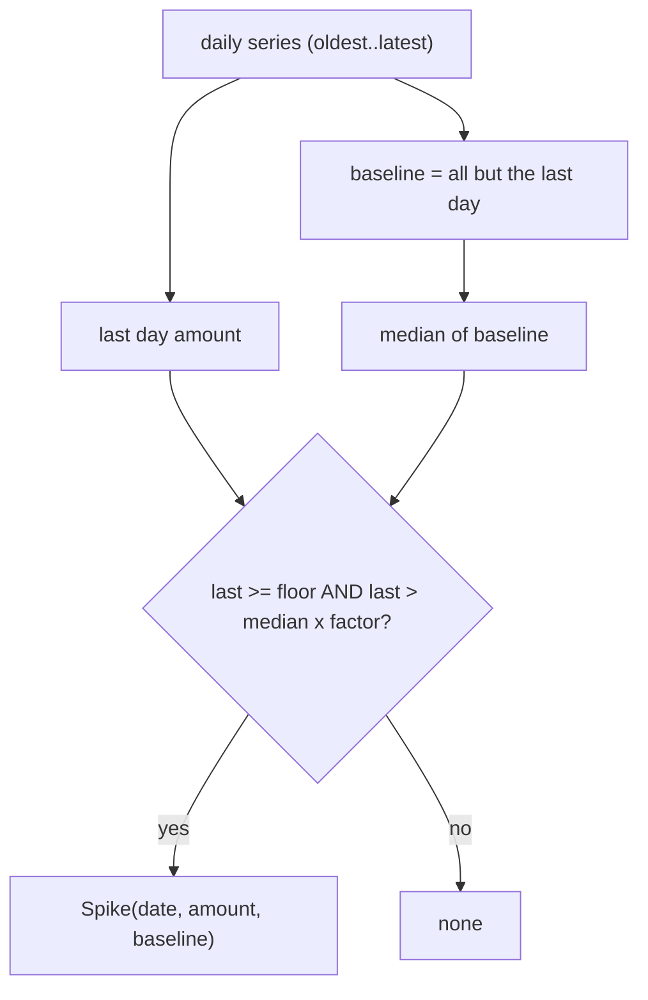

# FinOps + Security-Cost Design

## Cost rows in, findings out

## Series and the spike primitive (`costs.py`)

`daily_series(rows, match)` totals the matching rows per day and returns them oldest-first. Each
analyzer picks its `match` — all rows for the budget check, EC2 rows for compute, `DataTransfer-Out`
rows for egress — and hands the series to `detect_spike`:

Two guards make it trustworthy: the **floor** stops cheap noise from firing, and the **factor**
stops normal variance from firing. A brand-new cost with no baseline (median 0) above the floor
also counts — which is how "spend in a new region" and a sudden new line item both surface.

## Analyzers (`analyzers.py`)

Six analyzers, each returning zero or more `Hit(control_id, resource, detail)`:

- **untagged_spend** — sums rows missing the cost-allocation tag; fires above a dollar floor.
- **idle_resources** — sums known-waste usage types (idle Elastic IPs).
- **cost_anomaly** — a spike on the daily total (budget).
- **compute_spike** — a spike on the EC2 series (cryptomining signal).
- **egress_spike** — a spike on the `DataTransfer-Out` series (exfiltration signal).
- **new_region_spend** — a region with spend on the latest day and none before.

## Output and the gate

The engine turns hits into `endon_core.Finding` (source `endon.finops`, type `FinOps:...`), so a
cost anomaly converts to ASFF and reaches the SOC next to a GuardDuty finding for the same incident.
`endon-finops analyze --fail-on HIGH` returns a non-zero exit code when a security-cost spike fires,
so it can gate a scheduled cost-review job. Tests run over committed cost fixtures — no AWS,
milliseconds — and assert every control fires on the anomalous bill and none on the clean one.
