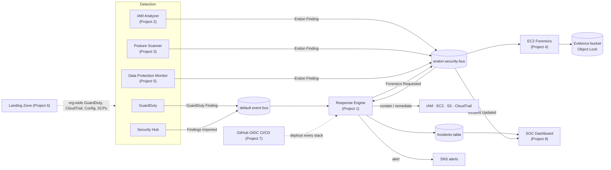

# Endon AI

**A cloud security engineering platform for AWS: threat detection, automated response, IAM analysis, posture management and governance, built to work as one system.**

Endon AI is a working platform under active development. Each component solves one
real AWS security problem, and all of them share one finding format, one event bus
and one incident record. That is what lets them work together: the posture scanner
finds a public bucket, the response engine closes it, and the SOC dashboard shows
the incident from detection to containment.

> **Status:** all **13 components** are built, tested and deployable — the core eight (Threat
> Detection & Response, IAM Analyzer, Posture Scanner, EC2 Forensics, Data Protection Monitor,
> Secure Landing Zone, Passwordless CI/CD, Security Operations Center) plus five market-driven
> extensions (Terraform IaC scanning, Kubernetes security, Azure multi-cloud posture, a
> CloudTrail SIEM, and FinOps + security-cost guardrails). Each component's README states exactly
> what exists today.

---

## The security problem

AWS environments produce plenty of security signals and not enough action.
GuardDuty flags a compromised access key, and then a person has to notice the alert,
work out what is affected, decide what to disable, and do it without destroying
evidence or locking out the wrong people. That takes hours. An attacker holding
valid credentials needs minutes.

Endon AI closes that gap with automation that is fast, and just as importantly,
**safe to leave switched on**.

## Platform architecture



## Components

| # | Component | The problem it solves | SCS-C03 domain | Status |
|---|-----------|-----------------------|----------------|--------|
| 1 | [Threat Detection & Response](01-threat-detection-response/) | Compromised credentials and hosts are contained in seconds, safely | Detection, Incident Response | **Built** |
| 2 | [IAM Least-Privilege & Privilege-Escalation Analyzer](02-iam-security-analyzer/) | Over-permissioned identities and hidden escalation paths | Identity and Access Management | **Built** |
| 3 | [Cloud Security Posture Scanner](03-security-posture-scanner/) | Misconfigurations attackers look for first | Detection, Infrastructure Security | **Built** |
| 4 | [EC2 Incident Response & Forensics](04-ec2-incident-response/) | Containment that preserves evidence | Incident Response | **Built** |
| 5 | [Data Protection & Secrets Exposure Monitor](05-data-protection-monitor/) | Exposed secrets, sensitive data and weak encryption | Data Protection | **Built** |
| 6 | [Secure Multi-Account Landing Zone](06-secure-landing-zone/) | Guardrails that no single account can switch off | Security Foundations and Governance | **Built** |
| 7 | [Passwordless GitHub → AWS CI/CD](07-github-oidc-cicd/) | Long-lived AWS keys in CI pipelines | IAM, Governance | **Built** |
| 8 | [Cloud Security Operations Center](08-security-operations-center/) | One view of posture, findings and incidents | Detection, Incident Response | **Built** |
| 9 | [Terraform IaC Security Scanner](09-terraform-iac-scanner/) | Insecure Terraform caught in the plan, before apply | Infrastructure Security, IAM | **Built** |
| 10 | [Kubernetes Security](10-kubernetes-security/) | Pod-spec + RBAC scanning and admission control | Infrastructure Security, IAM | **Built** |
| 11 | [Azure Posture Scanner](11-azure-posture/) | Multi-cloud: Azure CSPM in one finding format | Data Protection, Infrastructure Security | **Built** |
| 12 | [Log Detection Pipeline (SIEM-lite)](12-log-detection-pipeline/) | CloudTrail correlation detections + Sigma rules | Detection, Incident Response | **Built** |
| 13 | [FinOps + Security-Cost Guardrails](13-finops-cost-guardrails/) | Cost spikes as a compromise signal + waste | Governance, Incident Response | **Built** |

See [docs/scs-c03-coverage.md](docs/scs-c03-coverage.md) for the capability-by-domain map.

## How the components connect

Every component depends on [`endon-core`](endon-core/), a small standard-library
package that defines the platform's contracts:

- **`Finding`**: one normalized finding for every source, convertible to the AWS
  Security Finding Format (ASFF) for Security Hub.
- **`Incident`**: what happened, which playbook ran, each action taken, and a
  timestamped timeline.
- **Events**: components never call each other directly. They publish to the
  `endon-security-bus` EventBridge bus and subscribe with rules, so each one deploys
  independently while the platform behaves as one system.
- **Platform infrastructure**: a KMS key, the event bus, incident and finding
  tables, the alerts topic, and an Object Lock evidence bucket, shared by every stack.

Event contracts, trust boundaries and deployment topology are documented in
[docs/architecture.md](docs/architecture.md).

## Repository layout

```text
endon-ai/
├── endon-core/                     shared contracts + platform infrastructure
├── 01-threat-detection-response/   response engine (built)
├── 02-iam-security-analyzer/
├── 03-security-posture-scanner/
├── 04-ec2-incident-response/
├── 05-data-protection-monitor/
├── 06-secure-landing-zone/
├── 07-github-oidc-cicd/
├── 08-security-operations-center/
├── portfolio-site/                 the public site (endonai.com), built in Python
├── infrastructure/app.py           one CDK app that deploys the platform
├── tests/                          infrastructure security tests
└── docs/
```

The public-facing home for this work — the case studies, the architecture, and the
project index — is the [portfolio site](portfolio-site/), a self-contained static page
generated in Python and hosted at **endonai.com** (private S3 + CloudFront, deployed with
the CDK stack in that folder).

Each component follows the same layout: `src/`, `infrastructure/`, `tests/`,
`attack-simulation/`, `architecture/`, `evidence/`, and a README that starts with the
security problem.

## Run it

**Offline, no AWS account needed.** AWS is emulated with moto.

```bash
python -m venv .venv && source .venv/bin/activate   # Windows: .venv\Scripts\activate
pip install -r requirements-dev.txt
pytest
python 01-threat-detection-response/attack-simulation/offline_replay.py
```

**Deploy to AWS.** AWS CDK for Python.

```bash
npm install -g aws-cdk
cdk bootstrap
cdk deploy --all                                  # response engine starts in dry-run
cdk deploy --all -c endon:responseMode=enforce    # turn on automated containment
```

## Engineering principles

- **Safe by default.** Automated response deploys in dry-run, GuardDuty sample findings
  can never change resources, and guardrails protect break-glass identities, AWS
  service roles and the responder itself.
- **Evidence first.** Nothing is deleted. Keys are deactivated, access is removed with
  explicit denies, compromised instances stay running for forensics, and every
  action is written to the incident timeline.
- **Least privilege, verified by tests.** The infrastructure tests synthesize the
  CloudFormation and fail if any write permission is granted on `*`.
- **Trust boundaries are enforced in code.** Findings from Endon's own components can
  trigger configuration fixes but never lock out users or isolate hosts. Only
  AWS-native detectors, whose events cannot be forged, can do that.
- **Python throughout.** Application code, Lambda functions, infrastructure as code and
  tooling.

## License

[MIT](LICENSE)
