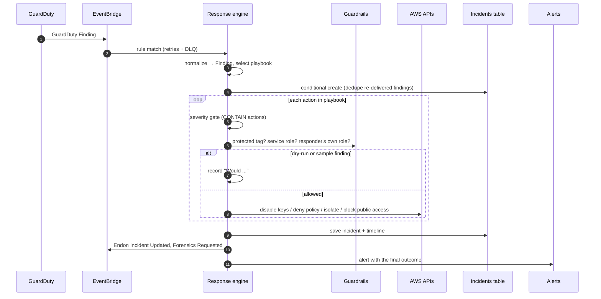

# Endon AI Platform Architecture

## Design goals

1. **Components are independent, and the platform is one system.** Each project deploys
   and runs on its own, and they cooperate through shared contracts rather than direct calls.
2. **Response automation must be safe to leave on.** Every automated change passes
   severity gates, guardrails and a dry-run switch, and is recorded.
3. **The same code runs locally and in AWS.** Event patterns, stores and handlers are
   exercised offline against emulated AWS APIs before they are deployed.

## Shared contracts (`endon-core`)

| Contract | Module | Purpose |
|----------|--------|---------|
| `Finding` | `endon_core.findings` | Normalized finding from any source; renders to ASFF |
| `Incident` | `endon_core.incidents` | Playbook, action records and timeline for one finding |
| Event sources and detail types | `endon_core.events` | Names every component publishes and subscribes with |
| `IncidentStore` / `FindingStore` | `endon_core.store` | DynamoDB persistence (in-memory for tests) |
| `Settings` | `endon_core.config` | Runtime configuration injected by CDK |
| `PlatformStack` | `endon-core/infrastructure` | KMS key, event bus, tables, alerts topic, evidence bucket |

`endon-core` has no third-party dependencies beyond boto3, so any Lambda function can
include it without packaging layers.

### Finding type taxonomy

Endon-generated finding types follow GuardDuty's `Category:Resource/Name` convention,
so native and Endon findings route through the same playbook rules:

| Producer | Example type |
|----------|--------------|
| GuardDuty | `UnauthorizedAccess:IAMUser/MaliciousIPCaller.Custom` |
| Security Hub (AWS controls) | `SecurityHub:S3.8` |
| Posture Scanner | `Posture:S3/BucketPubliclyAccessible` |
| IAM Analyzer | `IAM:Role/PrivilegeEscalationPath` |
| Data Protection Monitor | `DataProtection:S3/SensitiveDataPubliclyAccessible` |

## Event contracts

| Detail type | Source | Bus | Producer | Consumers |
|-------------|--------|-----|----------|-----------|
| `GuardDuty Finding` | `aws.guardduty` | default | GuardDuty | Response engine |
| `Security Hub Findings - Imported` | `aws.securityhub` | default | Security Hub | Response engine (HIGH/CRITICAL, non-GuardDuty) |
| `Endon Finding` | `endon.iam-analyzer`, `endon.posture-scanner`, `endon.data-protection` | `endon-security-bus` | Projects 2, 3, 5 | Response engine, SOC |
| `Endon Incident Updated` | `endon.detection` | `endon-security-bus` | Response engine | SOC dashboard |
| `Endon Forensics Requested` | `endon.detection` | `endon-security-bus` | Response engine | EC2 forensics (Project 4) |
| `Endon Forensics Completed` | `endon.forensics` | `endon-security-bus` | EC2 forensics | SOC dashboard |

The bus keeps a 90-day archive, so the events behind any incident can be replayed.

## Response flow

## Trust boundaries

| Boundary | Threat | Control |
|----------|--------|---------|
| Default bus → response engine | Forged GuardDuty/Security Hub events | EventBridge rejects `PutEvents` with `aws.*` sources, so these events can only come from AWS services |
| Endon bus → response engine | A principal with `events:PutEvents` publishes a fake compromise finding | Rule allowlists known producer sources. The normalizer trusts the event envelope's source over the payload. Playbooks restrict principal and host containment to AWS-native detectors |
| Security Hub imports | Custom findings imported by any principal with `BatchImportFindings` | Only findings from `:product/aws/` product ARNs are acted on |
| Response engine role | Compromised function code grants itself more access | Explicit deny on modifying its own role. Guardrail refuses to act on the responder's role. Deploys only through the CI/CD pipeline (Project 7) |
| Evidence | Evidence altered or deleted after collection | S3 Object Lock (governance, 90 days), versioning, KMS, access logging |

## Deployment topology

**Single account.** `cdk deploy --all` deploys the platform and all components into one
account and region. This is the lab and demo topology.

**Organization (with Project 6).** GuardDuty, Security Hub and AWS Config are enabled
organization-wide with a delegated administrator in a dedicated Security account,
which aggregates findings from every member account. The Endon platform and response
engine run in that Security account. Containment in member accounts uses a
cross-account response role, protected by SCPs so member-account administrators
cannot modify it.

## Data protection

| Data | Store | Protection |
|------|-------|------------|
| Incidents, findings | DynamoDB | Customer-managed KMS key, point-in-time recovery, deletion protection, retained on stack deletion |
| Alerts | SNS | KMS-encrypted topic, TLS enforced |
| Logs | CloudWatch Logs | KMS-encrypted, one-year retention, structured JSON |
| Evidence | S3 | KMS, Object Lock, versioning, Block Public Access, TLS enforced, access logs |
| Undeliverable events | SQS DLQ | Encrypted, 14-day retention, CloudWatch alarm |
